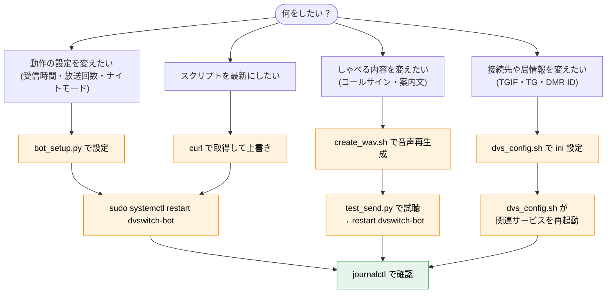

# OpenCCVoice / DVSwitch Bot 操作マニュアル（運用者向け）

**対象システム:** Raspberry Pi OS (Bookworm) + DVSwitch-Server + デーモン分離版 Bot（V1.61）
**スクリプト配置:** `/opt/dvswitch_bot/bin/`
**サービス名:** `dvswitch-bot`（ハイフン）

このマニュアルは「**こうしたいときは、これを打つ**」を素早く引くための逆引き集です。
各操作は「目的 → コマンド → 確認方法」をセットで記載しています。
仕組みの説明は別冊『システム仕様書』を参照してください。

---

## 目次

1. [まず覚える基本操作](#1-まず覚える基本操作)
2. [運用フロー（全体像）](#2-運用フロー全体像)
3. [日常操作：起動・停止・状態確認](#3-日常操作起動停止状態確認)
4. [ログの見方](#4-ログの見方)
5. [設定変更（受信時間・放送回数・ナイトモード）](#5-設定変更受信時間放送回数ナイトモード)
6. [音声の変更（固定WAV・試聴）](#6-音声の変更固定wav試聴)
7. [DVSwitch 設定の変更（コールサイン・TGIF・TG）](#7-dvswitch-設定の変更コールサインtgiftg)
8. [スクリプトの更新（GitHub から最新版を反映）](#8-スクリプトの更新github-から最新版を反映)
9. [バックアップと復元](#9-バックアップと復元)
10. [トラブル対応（逆引き）](#10-トラブル対応逆引き)
11. [よく使うコマンド早見表](#11-よく使うコマンド早見表)

---

## 1. まず覚える基本操作

迷ったらこの4つ。

```bash
# 状態を見る
sudo systemctl status dvswitch-bot --no-pager

# 再起動する（設定やスクリプトを変えた後）
sudo systemctl restart dvswitch-bot

# ログを流し見する（Ctrl+C で抜ける。bot は止まらない）
sudo journalctl -u dvswitch-bot -f

# 設定を変える（対話）→ 反映は再起動
sudo python3 /opt/dvswitch_bot/bin/bot_setup.py
sudo systemctl restart dvswitch-bot
```

> ⚠️ サービス名は **`dvswitch-bot`（ハイフン）**。`dvswitch_bot`（アンダースコア）では
> 「could not be found」になります。

---

## 2. 運用フロー（全体像）

「設定を変えたい」「音声を変えたい」など、目的別の作業の流れです。



**鉄則:** 設定やスクリプトを変えたら **必ず再起動**して、**ログで確認**する。

---

## 3. 日常操作：起動・停止・状態確認

### 3-1. 状態を確認する

```bash
sudo systemctl status dvswitch-bot --no-pager
```

**見るポイント:**
- `Active: active (running)` … 正常に動いている
- `Active: inactive (dead)` … 停止している
- `Active: activating (auto-restart)` … 起動に失敗して再起動を繰り返している（→ 設定不正を疑う。10章へ）

### 3-2. 起動・停止・再起動

```bash
sudo systemctl start dvswitch-bot      # 起動
sudo systemctl stop dvswitch-bot       # 停止
sudo systemctl restart dvswitch-bot    # 再起動（設定変更の反映に使う）
```

### 3-3. 自動起動（電源投入時に勝手に立ち上がる設定）

```bash
sudo systemctl enable dvswitch-bot     # 自動起動を有効化
sudo systemctl disable dvswitch-bot    # 自動起動を無効化
sudo systemctl is-enabled dvswitch-bot # 現在の設定を確認（enabled/disabled）
```

> 初回は `sudo systemctl enable --now dvswitch-bot` で「自動起動有効化＋即起動」を一度に行える。

---

## 4. ログの見方

常駐中の Bot は画面に出力されず、すべて journal（システムログ）に記録される。

### 4-1. リアルタイムで流し見する（最もよく使う）

```bash
sudo journalctl -u dvswitch-bot -f
```

`-f` は「流し続ける」。カーチャンク応答や時報が出る様子をそのまま眺められる。
**Ctrl+C で抜ける**（Bot は止まらず、表示だけ終わる）。

### 4-2. 直近のログをまとめて見る

```bash
sudo journalctl -u dvswitch-bot -n 50 --no-pager     # 直近 50 行
sudo journalctl -u dvswitch-bot --since today --no-pager        # 今日のぶん
sudo journalctl -u dvswitch-bot --since "1 hour ago" --no-pager # 直近1時間
```

### 4-3. ログの読み方（よく出るメッセージ）

| ログの例 | 意味 |
|---|---|
| `Config loaded /opt/dvswitch_bot/bot_config.json` | 設定の読み込み成功 |
| `Bot ready — monitoring DMR traffic` | 監視開始（正常起動の合図） |
| `Kerchunk detected: <callsign> (0.9s) trigger` | カーチャンクを検知して応答する |
| `receive:suppressed: <callsign> (... remaining ...)` | 抑制時間中なので応答しない |
| `Trigger 22:00 time_signal` | 22時の時報を送出 |
| `Trigger 001.wav scheduled_message` | 定時メッセージを送出 |
| `NightSkip ... time_signal suppressed (night mode)` | ナイトモードで時報を抑制 |
| `NightSkip ... scheduled_message suppressed (night mode)` | ナイトモードで定時メッセージを抑制 |
| `Config error ...` | 設定が不正。起動拒否（フェイルセーフ） |

### 4-4. エラーだけ拾う

```bash
sudo journalctl -u dvswitch-bot --since today --no-pager | grep -iE "error|!!|fail"
```

---

## 5. 設定変更（受信時間・放送回数・ナイトモード）

Bot 本体（`dvswitch_bot.py`）は**編集しない**。設定は必ず `bot_setup.py` で変える。

### 5-1. 現在の設定を確認する

```bash
sudo python3 /opt/dvswitch_bot/bin/bot_setup.py -s
```

設定値の表示と、有効性チェック（`[OK]` か `[WARN]`）が出る。

### 5-2. 設定を変更する（対話）

```bash
sudo python3 /opt/dvswitch_bot/bin/bot_setup.py
```

対話で以下を聞かれる（Enter で現在値を維持）:

| 項目 | 意味 | 既定 | 範囲 |
|---|---|---|---|
| 最小受信時間 (秒) | これ未満の電波は無視 | 0.5 | 0 より大 |
| 最大受信時間 (秒) | これ以上は通常交信とみなし応答しない | 3.9 | 最小 < 最大 |
| 放送回数 (1/2/3) | 1時間あたりの定時メッセージ回数（正時除く） | 2 | 1 / 2 / 3 |
| ナイトモード (y/n) | 夜間の時報・定時メッセージ抑制 | y | y / n |
| N1（開始時） | ナイトモード開始時刻 | 22 | 0〜23 |
| N2（終了時） | ナイトモード終了時刻 | 5 | 0〜23 |

### 5-3. 変更を反映する（必須）

```bash
sudo systemctl restart dvswitch-bot
sudo journalctl -u dvswitch-bot -n 25 --no-pager
```

起動ログで設定が反映されているか確認する。

### 5-4. ナイトモードの動作（V1.61）

放送回数を例えば「2回（:20, :40）」、N1=22, N2=5 と設定した場合:

| 時刻 | 時報（:00） | 定時メッセージ（:20, :40） |
|---|---|---|
| 〜21時台 | 出す | 出す |
| **22:00** | 出す（＋ナイトモード突入アナウンス） | — |
| **22:20, 22:40** | — | **抑制**（出さない） |
| 23時〜翌5時台 | 抑制 | 抑制 |
| 6:00〜 | 再開 | 再開 |

> ポイント: N1（22時）の時報と突入アナウンスは出るが、その後の同じ時間帯の
> 定時メッセージは出さない。起動ログでは
> `time_signal : suppress 23-05` / `sched_message : suppress 22-05` と表示される。
> （カーチャンク応答は 24 時間動作し、ナイトモードの影響を受けない）

---

## 6. 音声の変更（固定WAV・試聴）

コールサインや案内文を変えたいときは、固定 WAV を作り直す。

### 6-1. 固定 WAV を作り直す（対話）

```bash
cd /opt/dvswitch_bot/bin
sudo ./create_wav.sh
```

コールサイン・地名・定時メッセージ1/2 を対話入力すると、英数字を自動でカナ変換し、
`/opt/dvswitch_bot/` 直下に WAV を生成する（fixed_intro / fixed_outro / time_intro / 001 / 002）。

### 6-2. 生成された WAV を確認する

```bash
ls -la /opt/dvswitch_bot/*.wav
soxi /opt/dvswitch_bot/*.wav     # 8000Hz / 1ch / 16-bit になっているか
```

### 6-3. 試聴する（実際に電波に乗せて聞く）

二重送信を避けるため、**先に Bot を止める**。

```bash
sudo systemctl stop dvswitch-bot
python3 /opt/dvswitch_bot/bin/test_send.py /opt/dvswitch_bot/001.wav
python3 /opt/dvswitch_bot/bin/test_send.py /opt/dvswitch_bot/fixed_intro.wav
# 確認できたら Bot を戻す
sudo systemctl start dvswitch-bot
```

> Bot を止めずに test_send.py を実行すると、同じ UDP ポート(51000)に二重送信になり
> 音が崩れる。必ず stop してからテストする。

---

## 7. DVSwitch 設定の変更（コールサイン・TGIF・TG）

コールサイン・DMR ID・TGIF パスワード・送信 TG を変えるときは `dvs_config.sh` を使う。
3つの ini を編集する前に自動でバックアップを取る。

### 7-1. 設定変更（対話）

```bash
cd /opt/dvswitch_bot/bin
sudo ./dvs_config.sh
```

対話入力（Enter で現状維持）:

| 項目 | 例 |
|---|---|
| Callsign | `JJ2YYK` |
| DMR ID（7桁） | `4402519` |
| ESSID（2桁） | `11` |
| TGIF Password | （TGIF サイトで発行した値） |
| 送信 TG（txTg） | `44833` |

最後に「サービスを再起動しますか？(y/N)」と聞かれる。`y` で `analog_bridge` と
`mmdvm_bridge` が再起動され、設定が反映される。

### 7-2. バックアップから復元する

```bash
cd /opt/dvswitch_bot/bin
sudo ./dvs_config.sh -r
```

日付フォルダ（`/opt/bak/YYMMDDHHMMSS/`）の一覧が出るので、戻したい番号を選ぶ。

### 7-3. 古いバックアップを全部消す

```bash
cd /opt/dvswitch_bot/bin
sudo ./dvs_config.sh -d
```

---

## 8. スクリプトの更新（GitHub から最新版を反映）

GitHub リポジトリのスクリプトを更新したら、実機にも反映する。

### 8-1. 現行をバックアップ

```bash
sudo cp /opt/dvswitch_bot/bin/dvswitch_bot.py \
        /opt/dvswitch_bot/bin/dvswitch_bot.py.bak.$(date +%F_%H%M%S)
```

### 8-2. 最新版を取得して上書き

```bash
cd /opt/dvswitch_bot/bin
BASE=https://raw.githubusercontent.com/ji2tab/OpenCCVoice-For-DVSwitch/main
curl -fsSL "$BASE/dvswitch_bot.py" -o dvswitch_bot.py
chmod +x dvswitch_bot.py
```

> 他のスクリプトも更新したいときは、ファイル名を差し替えて同様に取得する
> （`bot_setup.py` / `test_send.py` / `create_wav.sh` / `dvs_config.sh`）。
> 5本まとめて取り直すなら:
> ```bash
> cd /opt/dvswitch_bot/bin
> for f in dvswitch_bot.py bot_setup.py test_send.py create_wav.sh dvs_config.sh; do
>   curl -fsSL "$BASE/$f" -o "$f"
> done
> chmod +x *.py *.sh
> ```

### 8-3. バージョンを確認して再起動

```bash
grep -n "Document Version" /opt/dvswitch_bot/bin/dvswitch_bot.py | head -1
sudo systemctl restart dvswitch-bot
sudo journalctl -u dvswitch-bot -n 25 --no-pager
```

起動ログのバージョン表記が更新されていれば反映成功。

---

## 9. バックアップと復元

### 9-1. 設定一式をまとめて保存する

```bash
mkdir -p ~/dvswitch_backup && cd ~/dvswitch_backup
sudo cp /opt/Analog_Bridge/Analog_Bridge.ini ./
sudo cp /opt/MMDVM_Bridge/MMDVM_Bridge.ini ./
cp /opt/dvswitch_bot/bin/dvswitch_bot.py ./
cp /opt/dvswitch_bot/bin/bot_setup.py ./
cp /opt/dvswitch_bot/bot_config.json ./
sudo cp /etc/systemd/system/dvswitch-bot.service ./ 2>/dev/null || true
cp /usr/share/hts-voice/mei/mei_normal.htsvoice ./
cd ~ && tar czf dvswitch_backup_$(date +%Y%m%d).tar.gz dvswitch_backup/
```

できた `dvswitch_backup_YYYYMMDD.tar.gz` を別の PC やクラウドに保管する。

### 9-2. ini だけ手早く戻す

`dvs_config.sh -r`（7-2）が、ini のバックアップ/復元には最も簡単。

### 9-3. SD カードまるごとバックアップ（推奨・別 PC で）

Pi をシャットダウンし、SD を別 PC に挿して:

```bash
sudo fdisk -l                       # デバイス名を必ず確認（/dev/sdX など）
sudo dd if=/dev/sdX of=~/pi_backup_$(date +%Y%m%d).img bs=4M status=progress
gzip ~/pi_backup_*.img
```

---

## 10. トラブル対応（逆引き）

| 症状 | 原因の候補 | 対処 |
|---|---|---|
| **サービスが見つからない** (`could not be found`) | 名前の打ち間違い | サービス名は `dvswitch-bot`（ハイフン）。アンダースコアではない |
| **`activating (auto-restart)` を繰り返す** | 設定不正でフェイルセーフ作動 | `journalctl -u dvswitch-bot -n 30` で `Config error` を確認 → `sudo python3 /opt/dvswitch_bot/bin/bot_setup.py` で設定し直す |
| **手動起動で `Config error` で止まる** | bot_config.json が無い/壊れ/値不正 | `bot_setup.py` で作成。`-s` で検証 |
| **音が出ない（無音）** | md380-emu 停止 or Analog 設定ミス | `sudo systemctl status md380-emu`。停止なら `sudo systemctl restart md380-emu` |
| **音がプツプツ/ケロケロ** | （通常は起きない設計）一時的負荷 | 一度 `restart dvswitch-bot`。頻発するなら CPU 温度・電源を確認 |
| **カーチャンクに反応しない** | 抑制時間中／受信時間が範囲外 | ログの `suppressed` や受信秒数を確認。`bot_setup.py` で最小/最大受信時間を見直す |
| **時報・定時が出ない** | ナイトモード中 | ログに `NightSkip` が出ていれば仕様通り。設定は `bot_setup.py -s` で確認 |
| **定時が夜間も出てしまう** | 旧版（V1.60以前）の可能性 | V1.61 以降に更新（8章）。起動ログのバージョンを確認 |
| **test_send で音が崩れる** | Bot と二重送信 | 先に `sudo systemctl stop dvswitch-bot` してからテスト |
| **Dashboard の Platform が Unknown** | 機種判定スクリプト | platformDetect.sh に device-tree 判定を追記（別資料の付録参照）。再起動は `apache2` |
| **md380-emu が SEGV** | qemu が新しすぎる | qemu-user-static を 5.2 系に固定（`apt-mark hold`）。`qemu-arm-static --version` を確認 |

---

## 11. よく使うコマンド早見表

```bash
# === サービス操作 ===
sudo systemctl status dvswitch-bot --no-pager   # 状態
sudo systemctl restart dvswitch-bot             # 再起動
sudo systemctl stop dvswitch-bot                # 停止
sudo systemctl start dvswitch-bot               # 起動

# === ログ ===
sudo journalctl -u dvswitch-bot -f              # リアルタイム
sudo journalctl -u dvswitch-bot -n 50 --no-pager # 直近50行

# === 設定 ===
sudo python3 /opt/dvswitch_bot/bin/bot_setup.py     # 設定変更
sudo python3 /opt/dvswitch_bot/bin/bot_setup.py -s  # 設定表示
sudo systemctl restart dvswitch-bot                 # 反映

# === 音声 ===
cd /opt/dvswitch_bot/bin && sudo ./create_wav.sh    # 音声再生成
python3 /opt/dvswitch_bot/bin/test_send.py /opt/dvswitch_bot/001.wav  # 試聴(要 stop)

# === DVSwitch 設定 ===
cd /opt/dvswitch_bot/bin && sudo ./dvs_config.sh     # 設定
cd /opt/dvswitch_bot/bin && sudo ./dvs_config.sh -r  # 復元

# === 関連サービス ===
sudo systemctl status md380-emu --no-pager
sudo systemctl restart analog_bridge mmdvm_bridge md380-emu
```

---

*OpenCCVoice / DVSwitch Bot 操作マニュアル（運用者向け）*
*対象: Bookworm + DVSwitch-Server + デーモン分離版 V1.61 / `/opt/dvswitch_bot/bin/` 配置*
*Contributors: JA2CCV / JI2TAB / JJ2YYK / OpenCCVoice Contributors*
