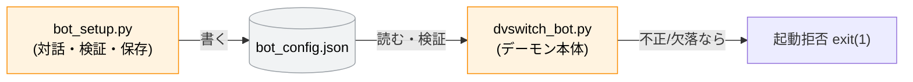
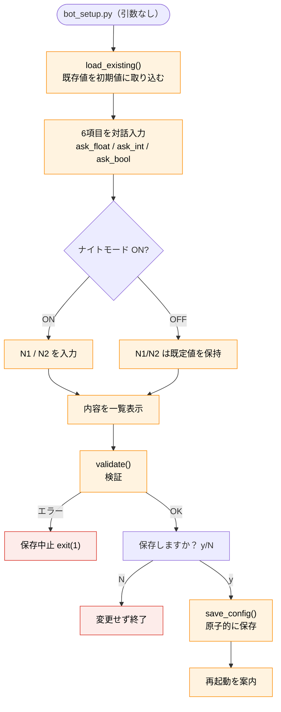

# bot_setup.py ソフトウェア仕様書

**対象ファイル:** `/opt/dvswitch_bot/bin/bot_setup.py`
**役割:** デーモン本体 `dvswitch_bot.py` が読む設定ファイル
`/opt/dvswitch_bot/bot_config.json` を、対話形式で作成・更新する設定ツール。

この文書は**スクリプト本体の内部仕様**を記述する技術文書です。日常の設定変更の
操作方法は『操作マニュアル』を参照してください。

---

## 目次

1. [概要と責務](#1-概要と責務)
2. [本体との関係](#2-本体との関係)
3. [実行環境・前提](#3-実行環境前提)
4. [定数仕様](#4-定数仕様)
5. [設定項目仕様](#5-設定項目仕様)
6. [コマンドライン仕様](#6-コマンドライン仕様)
7. [関数仕様](#7-関数仕様)
8. [処理フロー](#8-処理フロー)
9. [検証仕様](#9-検証仕様)
10. [入出力仕様](#10-入出力仕様)
11. [改修時の注意点](#11-改修時の注意点)

---

## 1. 概要と責務

`bot_setup.py` は、bot の動作設定（受信時間・放送回数・ナイトモード）を対話で入力し、
JSON ファイルに書き出すツール。次の責務を持つ。

1. **対話入力** — 6項目を、既存値・デフォルト値を初期表示しながら入力
2. **検証** — `dvswitch_bot.py` 本体と同じ基準で値の妥当性を確認
3. **保存** — `bot_config.json` を原子的に書き込む（一時ファイル＋`os.replace`）
4. **表示** — `-s` で現在の設定を表示し、有効性を判定

設計の中心は「**本体が起動を拒否しない、正しい設定ファイルだけを書き出す**」こと。
保存前に必ず検証し、不正なら保存しない。

---

## 2. 本体との関係

`dvswitch_bot.py`（デーモン本体）は対話機能を持たず、`bot_config.json` を読むだけ。
設定が無い／不正だと**本体は安全のため起動を拒否する（フェイルセーフ）**。
そのため、常駐させる前に必ず本ツールで設定を作る必要がある。



**検証基準は本体の `_load_config()` と同一**。本ツールの `validate()` が通る設定は、
本体でも通る。両者で同じルールを持つことで、「設定ツールでは OK なのに本体が起動
拒否する」という食い違いを防ぐ。

---

## 3. 実行環境・前提

| 項目 | 内容 |
|---|---|
| インタプリタ | Python 3（`#!/usr/bin/env python3`、UTF-8） |
| 依存 | 標準ライブラリ `os` / `sys` / `json` のみ（サードパーティ非依存） |
| 権限 | `/opt/dvswitch_bot/` への書き込みのため sudo 推奨 |
| 書き込み失敗時 | `PermissionError` を捕捉し、sudo 付き再実行を案内して `exit(1)` |

---

## 4. 定数仕様

| 定数 | 値 | 意味 |
|---|---|---|
| `BOT_DIR` | `/opt/dvswitch_bot` | 設定の基準ディレクトリ |
| `CONFIG_PATH` | `{BOT_DIR}/bot_config.json` | 出力する設定ファイル |
| `DEFAULTS` | 下表6項目 | デフォルト値（V1.60 のコード初期値準拠） |
| `REQUIRED_KEYS` | `list(DEFAULTS.keys())` | 必須キー一覧 |

### DEFAULTS

```python
{
  "RX_DURATION_MIN_SEC": 0.5,
  "RX_DURATION_MAX_SEC": 3.9,
  "ANNOUNCE_FREQ": 2,
  "NIGHT_MODE_ENABLED": True,
  "NIGHT_START_HOUR": 22,
  "NIGHT_END_HOUR": 5,
}
```

---

## 5. 設定項目仕様

| キー | 型 | 意味 | 既定 | 検証ルール |
|---|---|---|---|---|
| `RX_DURATION_MIN_SEC` | float | 最小受信時間（これ未満は無視） | 0.5 | `> 0` かつ `< MAX` |
| `RX_DURATION_MAX_SEC` | float | 最大受信時間（カーチャンク上限） | 3.9 | `MIN < MAX` |
| `ANNOUNCE_FREQ` | int | 1時間あたりの放送回数（正時除く） | 2 | `1 / 2 / 3` |
| `NIGHT_MODE_ENABLED` | bool | ナイトモード有効 | True | 厳密に bool 型 |
| `NIGHT_START_HOUR` | int | ナイトモード開始 N1 | 22 | `0〜23` |
| `NIGHT_END_HOUR` | int | ナイトモード終了 N2 | 5 | `0〜23` |

> ナイトモードを OFF にした場合も、`NIGHT_START_HOUR` / `NIGHT_END_HOUR` には
> 範囲内の値（既定値）を保持して保存する。本体の検証が全キーを要求するため、
> OFF でも有効な値を入れておく設計。

---

## 6. コマンドライン仕様

| 引数 | 動作 | 呼ぶ関数 |
|---|---|---|
| （なし） | 対話で作成・更新 | `do_edit` |
| `-s` / `--show` | 現在の設定を表示＋有効性判定 | `show_config` |
| `-h` / `--help` | ヘルプ（docstring）を表示 | `show_help` |
| その他 | エラー＋ヘルプ表示し `exit(1)` | — |

`main()` が `sys.argv[1]`（無ければ空文字）で分岐する。

---

## 7. 関数仕様

| 関数 | 役割 | 戻り値・副作用 |
|---|---|---|
| `validate(cfg)` | 設定 dict を検証 | エラーメッセージのリスト（空＝正常） |
| `load_existing()` | 既存設定を読む | dict / 無い・壊れていれば None |
| `save_config(cfg)` | 設定を原子的に保存 | 一時ファイル→`os.replace` |
| `show_config()` | 現在設定を表示＋検証結果 | 標準出力 |
| `ask_float(prompt,cur)` | float 入力（Enter で現在値維持） | float |
| `ask_int(prompt,cur,choices,lo,hi)` | int 入力（選択肢・範囲チェック対応） | int |
| `ask_bool(prompt,cur)` | y/n 入力 | bool |
| `do_edit()` | 対話編集の本体 | 検証→保存 |
| `show_help()` | docstring を表示 | 標準出力 |
| `main()` | 引数分岐 | エントリポイント |

### 入力ヘルパの仕様

3つの `ask_*` は共通して「**空入力（Enter）で現在値を維持**」する。不正入力は
エラーメッセージを出して再入力させるループ構造。

| 関数 | 追加チェック |
|---|---|
| `ask_float` | float 変換可能か |
| `ask_int` | int 変換可能か、`choices` 内か、`lo〜hi` 範囲内か |
| `ask_bool` | `y/yes` → True、`n/no` → False |

---

## 8. 処理フロー

### 対話編集（do_edit）



ポイント: **検証は確認表示の後、保存の前**に行う。検証エラーなら、保存可否を尋ねる
前に中止する。さらに保存前に y/N 確認があり、二段構えで誤保存を防ぐ。

### 設定表示（show_config, -s）

1. `load_existing()` で読む。無い／壊れていれば案内を出して終了
2. JSON を整形表示
3. `validate()` を実行し、`[OK]`（本体が起動できる）か `[WARN]`（起動拒否される）を表示

---

## 9. 検証仕様

`validate(cfg)` は、問題があればメッセージのリストを返す（空なら正常）。
**本体 `dvswitch_bot.py` の `_load_config()` と同一基準**。

### 検証の順序

1. **必須キーの存在** — 欠落キーがあれば列挙して即返す（以降は検証不能のため）
2. **型変換** — `float`/`int` への変換を試み、失敗（`ValueError`/`TypeError`）なら即返す
3. **bool 型チェック** — `NIGHT_MODE_ENABLED` が厳密に bool か
4. **範囲・選択肢チェック**:
   - `RX_DURATION_MIN_SEC > 0`
   - `MIN < MAX`
   - `ANNOUNCE_FREQ ∈ {1,2,3}`
   - `0 ≤ N1 ≤ 23`、`0 ≤ N2 ≤ 23`

複数の問題があれば、4の範囲チェックは可能な限りまとめて報告する（1・2は早期 return）。

---

## 10. 入出力仕様

### 入力（load_existing）

`CONFIG_PATH` を読み、JSON パースして dict なら返す。ファイルが無い・パース失敗・
dict でない場合は `None`。例外は握りつぶして `None` を返す（壊れた設定は「無い」と
同等に扱い、デフォルトから作り直せるようにする）。

### 出力（save_config）— 原子的書き込み

```python
tmp = CONFIG_PATH + ".tmp"
# tmp に json.dump（ensure_ascii=False, indent=2）
os.replace(tmp, CONFIG_PATH)   # 原子的に置き換え
```

一時ファイルに書いてから `os.replace` で差し替える。書き込み途中で中断しても、
既存の設定ファイルが半端な状態で壊れない（**原子的更新**）。`ensure_ascii=False` で
日本語もそのまま、`indent=2` で人が読める整形。

### 出力例（bot_config.json）

```json
{
  "RX_DURATION_MIN_SEC": 0.5,
  "RX_DURATION_MAX_SEC": 3.9,
  "ANNOUNCE_FREQ": 2,
  "NIGHT_MODE_ENABLED": true,
  "NIGHT_START_HOUR": 22,
  "NIGHT_END_HOUR": 5
}
```

---

## 11. 改修時の注意点

| 項目 | 注意 |
|---|---|
| **本体と検証を揃える** | `validate()` は本体 `_load_config()` と同一基準。片方だけ変えると「ツールではOKなのに本体が起動拒否」になる |
| **キーを増やすとき** | `DEFAULTS` に追加すれば `REQUIRED_KEYS` も自動で増える。本体側の必須キー・検証も同時に更新 |
| **原子的書き込みを崩さない** | `save_config` の tmp→`os.replace` は設定破損防止。直接 open して書く方式に変えない |
| **OFF でも N1/N2 を保持** | ナイトモード OFF でも範囲内の値を入れる。本体が全キーを検証するため |
| **bool は厳密判定** | `NIGHT_MODE_ENABLED` は `isinstance(..., bool)`。1/0 や "true" 文字列は不可 |
| **保存後は再起動が必要** | 設定変更を本体に反映するには `sudo systemctl restart dvswitch-bot`。ツールは案内を出すだけ |

---

*bot_setup.py ソフトウェア仕様書*
*対象: /opt/dvswitch_bot/bin/bot_setup.py（bot_config.json の作成・更新ツール）*
*Contributors: JA2CCV / JI2TAB / JJ2YYK / OpenCCVoice Contributors*
