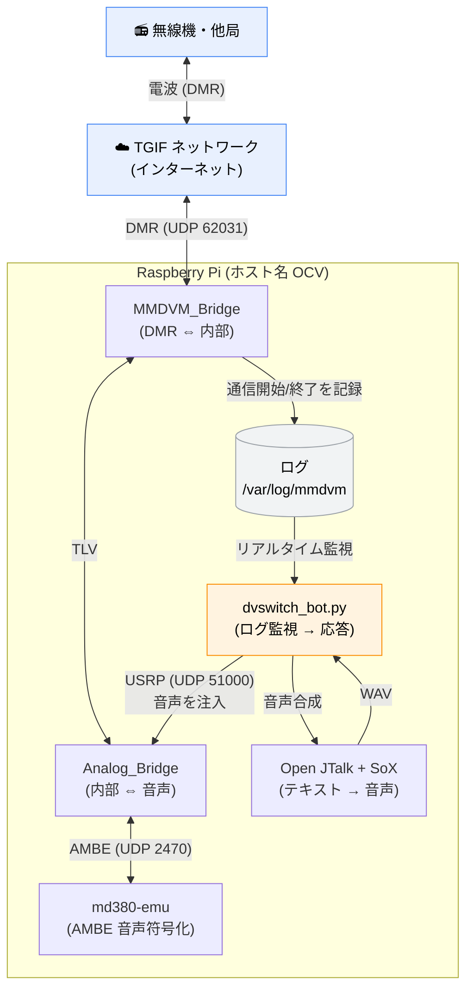

# OpenCCVoice / DVSwitch 自動音声応答システム 仕様書

**対象構成:** Raspberry Pi OS (Bookworm) + DVSwitch-Server + デーモン分離版 Bot

**スクリプト配置:** `/opt/dvswitch_bot/bin/`

**エディション構成（2エディション）:** 本システムには音声合成エンジンの異なる2エディションがある。**JT版（Open JTalk 版）** は `ocv_dvs_jt/`（Raspberry Pi ノード向け、上記の構成が標準）、**VV版（VOICEVOX 版）** は `ocv_dvs_vv/`（x86_64 Linux 向け）。本仕様書の本文は JT版を基準に記述し、VV版固有の差分は各所の「VV版」注記および第8章の systemd 例で補足する。Web ダッシュボード（`dashboard/app.py`）は両版で共用。版番号の `vv` サフィックスは VOICEVOX 系ノード用を示す命名規約。

**この仕様書について:** システムの全体像（概要）と、技術的な詳細仕様の両方を記載します。
はじめての方はまず「第1章 これは何か」「第2章 全体構成」を読めば全体像がつかめます。
構築・改修する方は「第4章 ファイル配置」以降の詳細仕様を参照してください。

---

## 目次

**― 概要編（まず全体像をつかむ）―**
1. [これは何か（システムの目的）](#1-これは何かシステムの目的)
2. [全体構成（データの流れ）](#2-全体構成データの流れ)
3. [登場するソフトウェアと役割](#3-登場するソフトウェアと役割)


**― 詳細仕様編（構築・改修のための技術情報）―**

4. [ファイル配置仕様](#4-ファイル配置仕様)
5. [スクリプト構成（5本の役割と入出力）](#5-スクリプト構成5本の役割と入出力)
6. [設定ファイル仕様](#6-設定ファイル仕様)
7. [ネットワーク・ポート仕様](#7-ネットワークポート仕様)
8. [systemd サービス仕様](#8-systemd-サービス仕様)
9. [Bot 内部仕様（定数・動作ロジック）](#9-bot-内部仕様定数動作ロジック)
10. [運用手順（起動・停止・確認・変更）](#10-運用手順起動停止確認変更)
11. [既知の注意点・ハマりどころ](#11-既知の注意点ハマりどころ)

---

# 概要編

## 1. これは何か（システムの目的）

このシステムは、**アマチュア無線のデジタル方式（DMR）で、短い電波（カーチャンク）を受けると自動で音声アナウンスを返す**仕組みです。無人のデジピーター（中継局）が、アクセスしてきた局に「応答」を返したり、毎正時に時報を流したり、定時の案内放送をしたりします。

具体的には、こういうことをします。

- **カーチャンク自動応答** … 誰かが短く電波を出す（PTTをチョン押し）と、「カーチャンクです」等の音声を自動で返す
- **毎正時の時報** … 「〇〇時です」を自動送出
- **定時アナウンス** … 案内メッセージ（001/002）を1時間に1〜3回送出
- **ナイトモード** … 夜間は時報・定時放送を抑制（カーチャンク応答は24時間動作）
- **長時間通信時の識別信号（法令対応）** … 無線局運用規則第30条に基づき、長時間の交信が続く間は10分ごとに自局の識別信号を強制送信
- **応答の即時化** … よく使われるコールサインの応答音声はあらかじめキャッシュしておき、待たされる感じを減らす

**たとえるなら:** 「無線版の留守番電話＋時報サービス」です。人が話しかける代わりに無線で短くアクセスすると、機械が決まった音声で応答します。

---

## 2. 全体構成（データの流れ）

電波が入ってから音声で応答が返るまで、データは次のように流れます。



**流れを言葉で説明すると:**

1. 他局が電波を出すと、TGIF ネットワーク経由で **MMDVM_Bridge** がそれを受け取り、**動作ログ**（テキスト）に「通信開始」「通信終了」を書き込む。
2. **dvswitch_bot.py** は、このログをリアルタイムで監視している。短い電波（カーチャンク）を検知すると「応答すべき」と判断する。
3. Bot は **Open JTalk**（音声合成）と **SoX**（音声変換）で応答音声（WAV）を用意する。
4. Bot はその音声を **USRP プロトコル**（UDP）で **Analog_Bridge** に送り込む。
5. Analog_Bridge は音声を **md380-emu**（AMBE 符号化）と連携して DMR 用に変換し、MMDVM_Bridge 経由で TGIF へ送出する。
6. 結果として、アクセスしてきた局のスピーカーから応答音声が流れる。

**なぜログ監視方式なのか:** 「音が鳴ったか」をマイクで聞く方式（VOX）はノイズで誤動作します。本システムは MMDVM_Bridge が出す**デジタルなログ文字列**（"header" / "end of voice"）を読むため、誤検知がなく正確なタイミングで応答できます。

---

## 3. 登場するソフトウェアと役割

| ソフトウェア | 役割 | たとえると |
|---|---|---|
| **MMDVM_Bridge** | DMR ネットワーク（TGIF）と内部をつなぐ。通信の開始/終了をログに書く | 「電話交換機」 |
| **Analog_Bridge** | 内部のアナログ音声と DMR をつなぐ。USRP で外部から音声を受け取る | 「音声の入口/出口」 |
| **md380-emu** | 音声を DMR 用の AMBE 形式に符号化する（ソフトウェア Vocoder） | 「音声の翻訳機」 |
| **dvswitch_bot.py** | ログを監視し、条件に応じて応答音声を生成・送出する本体（デーモン） | 「司令塔」 |
| **bot_setup.py** | Bot の動作設定（受信時間・放送回数・ナイトモード）を対話で作る | 「設定パネル」 |
| **Open JTalk** | テキストを日本語音声に変換する音声合成エンジン | 「読み上げソフト」 |
| **SoX** | 音声を 8kHz/モノラル/16bit に変換する | 「音声フォーマット変換器」 |
| **Monit** | 各サービスの稼働を監視する（:2812 の画面で状態表示） | 「監視カメラ」 |
| **Apache2** | DVSwitch Dashboard（:80）を表示する Web サーバ | 「掲示板」 |

---

### VV版（VOICEVOX 版）の構成要素

VV版（`ocv_dvs_vv/`、x86_64 Linux 向け）では、上表のうち **Open JTalk + SoX** の音声合成部分が **VOICEVOX CORE** に置き換わる。SoX（8kHz/mono/16bit 変換）と md380-emu・Analog_Bridge・MMDVM_Bridge の構成は JT版と共通。

| VV版の構成要素 | 役割 |
|---|---|
| `/opt/voicevox/dist` | VOICEVOX CORE 一式（ONNX Runtime・Open JTalk 辞書・音声モデル `.vvm`） |
| venv（`/opt/dvswitch_bot/venv`） | `voicevox_core` を含む Python 仮想環境。bot も `vv_say.py` もこの python3 で動く |
| `vv_say.py`（`/opt/voicevox/`） | VOICEVOX で固定 WAV を合成する小ツール（`create_wav.sh` VV版から呼ばれる） |
| `dvswitch_bot.py`（VV版） | 起動時に VOICEVOX を1回ロードし、動的合成（時報の時刻等）を同一プロセス内で行う |

**話者選択の共有:** 話者（`style_id` / `vvm`）は `wav_source.json` の `"voice"` に記録され、**①固定 WAV（`create_wav.sh` → `vv_say.py`）** と **②動的合成（bot 起動時ロード）** の両系統がこれを参照して揃う。話者変更の動的合成への反映には bot 再起動が必要（固定 WAV は送出のたび読み直すため再起動不要）。

---

# 詳細仕様編

## 4. ファイル配置仕様

システムを構成するファイルの置き場所の一覧です。**「スクリプトは `bin/`、データは直下」**が基本ルールです。

### 4-1. Bot 関連（`/opt/dvswitch_bot/`）

```
/opt/dvswitch_bot/
├── bin/                      ← スクリプト（実行ファイル）5本
│   ├── dvswitch_bot.py       … デーモン本体
│   ├── bot_setup.py          … 設定ツール
│   ├── test_send.py          … 単発送信テストツール
│   ├── create_wav.sh         … 固定 WAV 生成ツール
│   └── dvs_config.sh         … DVSwitch ini 設定ツール
│
├── bot_config.json           ← Bot の設定（bot_setup.py が作成）
├── fixed_intro.wav           ← カーチャンク応答イントロ
├── fixed_outro.wav           ← カーチャンク応答アウトロ
├── time_intro.wav            ← 時報イントロ
├── 001.wav                   ← 定時メッセージ1
├── 002.wav                   ← 定時メッセージ2
├── time_outro.wav            ← (未使用・無害。create_wav.sh が生成)
├── cstm_intro.wav            ← (任意) intro のカスタム音声（利用者が用意。V1.73〜）
├── cstm_001.wav              ← (任意) 001 のカスタム音声（利用者が用意）
└── cstm_002.wav              ← (任意) 002 のカスタム音声（利用者が用意）
```

> **設計のポイント:** Bot 本体のコードは `BOT_DIR = "/opt/dvswitch_bot"` を基準に
> WAV・JSON を探す。スクリプトを `bin/` に置いても WAV・JSON は直下のままなので、
> **コードの変更は不要**（スクリプトの置き場所と、データの置き場所は独立）。

### 4-2. DVSwitch 本体（システムが用意）

| パス | 内容 |
|---|---|
| `/opt/MMDVM_Bridge/MMDVM_Bridge.ini` | MMDVM_Bridge 設定 |
| `/opt/MMDVM_Bridge/DVSwitch.ini` | DVSwitch 設定（exportTG 等） |
| `/opt/Analog_Bridge/Analog_Bridge.ini` | Analog_Bridge 設定（USRP ポート等） |
| `/opt/md380-emu/md380-emu` | AMBE 符号化バイナリ |

### 4-3. システム・OS 側

| パス | 内容 |
|---|---|
| `/etc/systemd/system/dvswitch-bot.service` | Bot の常駐定義（systemd） |
| `/var/log/mmdvm/MMDVM_Bridge-YYYY-MM-DD.log` | MMDVM_Bridge ログ（Bot の監視対象） |
| `/var/lib/mecab/dic/open-jtalk/naist-jdic` | Open JTalk 辞書（`open-jtalk/` を含む点に注意） |
| `/usr/share/hts-voice/mei/mei_normal.htsvoice` | 音声モデル「メイ」 |
| `/dev/shm/` | 一時音声ファイル（RAM ディスク。SD カード保護） |
| `/opt/dvswitch_bot/bak/ini/YYMMDDHHMMSS/` | dvs_config.sh による ini バックアップ |
| `/usr/local/sbin/platformDetect.sh` | Dashboard の機種判定スクリプト |

---

## 5. スクリプト構成（5本の役割と入出力）

### 5-1. dvswitch_bot.py（デーモン本体）

| 項目 | 内容 |
|---|---|
| 役割 | ログを監視し、条件に応じて応答音声を生成・送出する常駐プロセス |
| 入力 | MMDVM_Bridge ログ（`/var/log/mmdvm/`）、設定（`bot_config.json`）、固定 WAV 5本 |
| 出力 | USRP パケット（UDP 127.0.0.1:51000 → Analog_Bridge） |
| 対話 | **なし**（設定は JSON から読むだけ。systemd 常駐向け） |
| 安全機構 | 設定が無い/壊れ/値不正なら**起動を拒否**（フェイルセーフ） |
| 起動例 | `python3 /opt/dvswitch_bot/bin/dvswitch_bot.py` |

### 5-2. bot_setup.py（設定ツール）

| 項目 | 内容 |
|---|---|
| 役割 | `bot_config.json` を対話で作成・更新する |
| 出力 | `/opt/dvswitch_bot/bot_config.json` |
| オプション | `-s`（現在の設定を表示＋検証）/ `-h`（ヘルプ） |
| 実行例 | `sudo python3 /opt/dvswitch_bot/bin/bot_setup.py` |
| 備考 | デーモン本体と同じ検証ロジックを持ち、保存前に値の妥当性を確認する |

### 5-3. test_send.py（送信テストツール）

| 項目 | 内容 |
|---|---|
| 役割 | 指定 WAV を USRP で単発送信し、経路を確認する |
| 入力 | WAV ファイルパス（引数） |
| 出力 | USRP パケット（UDP 127.0.0.1:51000） |
| 実行例 | `python3 /opt/dvswitch_bot/bin/test_send.py /opt/dvswitch_bot/001.wav` |
| 注意 | Bot 常駐中は二重送信になるため、先に `sudo systemctl stop dvswitch-bot` |

### 5-4. create_wav.sh（固定 WAV 生成ツール）

| 項目 | 内容 |
|---|---|
| 役割 | コールサイン・地名・定時メッセージを対話入力し、固定 WAV を一括生成 |
| 出力 | `/opt/dvswitch_bot/` 直下に WAV（fixed_intro/outro, time_intro, 001, 002 ほか） |
| バックアップ | 上書き直前に既存 `*.wav` を `/opt/dvswitch_bot/bak/wav/YYMMDDHHMMSS/` へ自動退避 |
| オプション | `-r`（バックアップから復元）/ `-d`（WAVバックアップ全削除）/ `-h`（ヘルプ） |
| 実行例 | `cd /opt/dvswitch_bot/bin && sudo ./create_wav.sh` |
| 備考 | 英数字を自動でカナ変換。辞書・音声モデルのパスはスクリプト内に実装済み。bot は送出のたびに WAV を読むため上書きは再起動なしで反映 |

### 5-5. dvs_config.sh（DVSwitch ini 設定ツール）

| 項目 | 内容 |
|---|---|
| 役割 | TGIF 接続前提で 3つの ini を対話設定。編集前に自動バックアップ |
| 対象 | MMDVM_Bridge.ini / DVSwitch.ini / Analog_Bridge.ini |
| 入力項目 | callsign / dmrid(7桁) / essid(2桁) / TGIF password / 送信TG(txTg) |
| オプション | `-r`（復元）/ `-d`（バックアップ全削除）/ `-h`（ヘルプ） |
| 実行例 | `cd /opt/dvswitch_bot/bin && sudo ./dvs_config.sh` |

---

## 6. 設定ファイル仕様

### 6-1. bot_config.json（Bot 動作設定）

`bot_setup.py` が生成。`dvswitch_bot.py` が起動時に読み込む。

| キー | 型 | 意味 | 既定値 | 制約 |
|---|---|---|---|---|
| `RX_DURATION_MIN_SEC` | 数値 | 最小受信時間（これ未満は無視） | 0.5 | 0 < MIN |
| `RX_DURATION_MAX_SEC` | 数値 | 最大受信時間（これ以上はカーチャンクとしない） | 3.9 | MIN < MAX |
| `ANNOUNCE_FREQ` | 整数 | 1時間あたりの定時放送回数 | 2 | `TIME_SIGNAL_MODE` に応じて 0〜4（詳細は dvswitch_bot ソフトウェア仕様書） |
| `NIGHT_MODE_ENABLED` | 真偽 | ナイトモード有効/無効 | true | true / false |
| `NIGHT_START_HOUR` | 整数 | ナイトモード開始時 N1 | 22 | 0〜23 |
| `NIGHT_END_HOUR` | 整数 | ナイトモード終了時 N2 | 5 | 0〜23 |
| `TIME_SIGNAL_MODE` | 整数 | 時刻案内モード（0=なし/1=毎正時/2=+毎30分）。任意キー | 1 | 0 / 1 / 2 |
| `TX_GAIN` | 数値 | 送出音量の線形倍率。任意キー | 1.0 | 0.0超〜5.0以下 |
| `USE_CSTM_INTRO` | 真偽 | intro にカスタム音声を使う。任意キー | false | true / false |
| `USE_CSTM_001` | 真偽 | 001 にカスタム音声を使う。任意キー | false | true / false |
| `USE_CSTM_002` | 真偽 | 002 にカスタム音声を使う。任意キー | false | true / false |

**JSON の例:**

```json
{
  "RX_DURATION_MIN_SEC": 0.5,
  "RX_DURATION_MAX_SEC": 3.9,
  "TIME_SIGNAL_MODE": 1,
  "ANNOUNCE_FREQ": 2,
  "NIGHT_MODE_ENABLED": true,
  "NIGHT_START_HOUR": 22,
  "NIGHT_END_HOUR": 5,
  "TX_GAIN": 1.0,
  "USE_CSTM_INTRO": false,
  "USE_CSTM_001": false,
  "USE_CSTM_002": false
}
```

> **フェイルセーフ:** 必須キー（受信時間・時刻案内モード・放送回数・ナイトモード関連）が
> 欠ける、型が違う、範囲外、という場合、デーモン本体はエラーを表示して**起動しない**。
> 意図しない送信パラメータで電波を出さないための安全策。
>
> **任意キー:** `TX_GAIN`・`USE_CSTM_*` は欠けても起動し、既定値を採用する（後方互換）。
> `USE_CSTM_*` を true にしても対応する `cstm_*.wav` が無ければ標準音声へ自動フォールバック
> する（詳細は `カスタム音声.md`）。

### 6-2. dvs_config.sh が設定する ini 項目

**対話入力する可変項目:**

| 入力 | 反映先 |
|---|---|
| callsign | MMDVM `Callsign` |
| dmrid (7桁) | MMDVM `Id`（先頭7桁）、Analog `gatewayDmrId`、`repeaterID`（先頭7桁） |
| essid (2桁) | MMDVM `Id`（末尾2桁）、Analog `repeaterID`（末尾2桁） |
| TGIF password | MMDVM `Password` |
| 送信TG (txTg) | Analog `txTg` |

**スクリプトが固定値でセットする項目:**

| 項目 | 値 |
|---|---|
| MMDVM `[DMR] Enable` | 1 |
| MMDVM `[DMR Network] Enable` | 1 |
| MMDVM `[DMR Network] Address` | `tgif.network` |
| Analog `[USRP] txPort` | 51001 |
| Analog `[USRP] rxPort` | 51000 |
| Analog `[USRP] usrpAudio` | `AUDIO_USE_GAIN` |
| Analog `[USRP] tlvAudio` | `AUDIO_USE_GAIN` |

---

## 7. ネットワーク・ポート仕様

すべてローカル（127.0.0.1）通信、または Pi から外部への通信です。

| ポート | 用途 | 向き | プロトコル |
|---|---|---|---|
| **51000** | dvswitch_bot.py → Analog_Bridge（USRP 受信） | Bot→AB | UDP |
| **51001** | Analog_Bridge の出力（txPort） | AB→ | UDP |
| **2470** | Analog_Bridge ⇔ md380-emu（AMBE 符号化） | 相互 | UDP |
| **62031** | MMDVM_Bridge → TGIF ネットワーク（DMR） | Pi→外部 | UDP |
| **80** | DVSwitch Dashboard（Apache2） | 閲覧 | TCP |
| **2812** | Monit Service Manager（サービス監視画面） | 閲覧 | TCP |

> **重要な対応関係:** Bot が送る先（UDP 51000）は、Analog_Bridge の `rxPort = 51000`
> と一致していなければならない。この一致が崩れると音声が届かない。

---

## 8. systemd サービス仕様

### 8-1. サービス定義

**ファイル:** `/etc/systemd/system/dvswitch-bot.service`
**サービス名:** `dvswitch-bot`（**ハイフン**。アンダースコアではない）

```ini
[Unit]
Description=DVSwitch Bot (OpenCCVoice, daemon based on V1.60)
After=network.target analog_bridge.service mmdvm_bridge.service md380-emu.service
Wants=analog_bridge.service mmdvm_bridge.service md380-emu.service

[Service]
Type=simple
ExecStart=/usr/bin/python3 /opt/dvswitch_bot/bin/dvswitch_bot.py
Restart=on-failure
RestartSec=10
User=ocv
StandardOutput=journal
StandardError=journal

[Install]
WantedBy=multi-user.target
```

### 8-1b. VV版のサービス定義（ExecStart が venv）

VV版（VOICEVOX）では、`ExecStart` を **venv の python3** にする。システムの `/usr/bin/python3` では `voicevox_core` を import できず `ImportError/ModuleNotFoundError` で即死するため、ここが最重要の差分。

```ini
[Unit]
Description=OpenCCVoice DVSwitch bot (VV / dvswitch_bot.py)
After=network.target md380-emu.service analog_bridge.service mmdvm_bridge.service
Wants=analog_bridge.service mmdvm_bridge.service

[Service]
Type=simple
ExecStart=/opt/dvswitch_bot/venv/bin/python3 /opt/dvswitch_bot/bin/dvswitch_bot.py
WorkingDirectory=/opt/dvswitch_bot
Restart=on-failure
RestartSec=5

[Install]
WantedBy=multi-user.target
```

> JT版（上の 8-1）は `ExecStart=/usr/bin/python3 ...`。VV版はここを `/opt/dvswitch_bot/venv/bin/python3 ...` に置き換える点だけが本質的な違い。

### 8-2. 各設定の意味

| 設定 | 意味 |
|---|---|
| `After` / `Wants` | Analog_Bridge 等が起動してから Bot を起動する（依存関係） |
| `ExecStart` | 起動コマンド。`bin/` 配置の本体を指す |
| `Restart=on-failure` | 異常終了したら自動再起動。**設定不正時は再起動を繰り返す**（＝設定漏れに気づける） |
| `User=ocv` | 実行ユーザー |
| `StandardOutput=journal` | 画面出力の代わりに journal（`journalctl` で閲覧）へ記録 |

---

## 9. Bot 内部仕様（定数・動作ロジック）

### 9-1. 主要な内部定数（dvswitch_bot.py）

| 定数 | 値 | 意味 |
|---|---|---|
| `UDP_IP` | `127.0.0.1` | 送信先（Analog_Bridge） |
| `UDP_PORT` | `51000` | 送信先ポート（Analog の rxPort と一致） |
| `MY_CALLSIGN` | `JJ2YYK` | 自局コールサイン（応答ログ等に使用） |
| `DICT_PATH` | `/var/lib/mecab/dic/open-jtalk/naist-jdic` | Open JTalk 辞書 |
| `VOICE_PATH` | `/usr/share/hts-voice/mei/mei_normal.htsvoice` | 音声モデル |
| `BOT_DIR` | `/opt/dvswitch_bot` | WAV・JSON の基準ディレクトリ |
| `PACKET_INTERVAL` | `0.02` | USRP パケット送信間隔（20ms） |
| `PRE_POST_PADDING_PACKETS` | `75` | 音声の前後に付ける無音（1.5秒） |
| `SUPPRESS_DURATION_SEC` | `15.0` | 応答後の抑制時間（連続応答を防ぐ） |
| `EMPTY_HEADER_THRESHOLD_SEC` | `0.1` | 空ヘッダ判定の閾値 |
| `ROTATION_CHECK_INTERVAL` | `5.0` | ログ切替チェック間隔（秒） |
| `GAP_AFTER_INTRO_SEC` | `0.5` | イントロ後の無音（連結時の「間」） |
| `TIME_SIGNAL_LEAD_SEC` | `7` | 時報の先行送出（正時の何秒前に出すか） |
| `NIGHT_ANN_GAP_SEC` | `1.0` | ナイト関連アナウンスの間隔 |
| `MY_DMR_ID` | （設定値） | 自局 DMR ID。`Analog_Bridge.ini` の `gatewayDmrId` と一致させる（SET_INFO メタデータ用） |
| `TX_METADATA_ENABLED` | `True` | 送信前に SET_INFO メタデータ（コールサイン/ID）を送るか |
| `USRP_EOT_REPEAT` | `1` | 送信終端（PTT OFF）の送出回数。取りこぼし対策で複数回送出可 |
| `WATCHDOG_PSEUDO_END_ENABLED` | `True` | 終端パケットが落ちた送信を watchdog ログから拾って救済するか |
| `WATCHDOG_MAX_LOSS_PCT` | `75` | この値を超えるパケットロスの watchdog は「壊れた受信」として救済しない |
| `QSO_ID_INTERVAL_SEC` | `600.0`（10分） | 長時間通信セッションで識別信号を強制送信する間隔（無線局運用規則第30条対応） |
| `REPLY_CACHE_ENABLED` | `True` | 応答音声のキャッシュ機構を使うか（即応答化） |

### 9-2. 一時ファイル（/dev/shm = RAM ディスク）

プロセス ID（PID）付きで生成し、SD カードへの書き込みを避ける。

- `/dev/shm/reply_final_<PID>.wav`
- `/dev/shm/tmp_48k_<PID>.wav`
- `/dev/shm/tmp_8k_<PID>.wav`
- `/dev/shm/tmp_intro_padded_<PID>.wav`

### 9-3. カーチャンク検知ロジック（概念）

1. MMDVM_Bridge ログから「通信開始」「通信終了」を検出し、受信時間を算出する。
2. 受信時間が `RX_DURATION_MIN_SEC` 〜 `RX_DURATION_MAX_SEC` の範囲内なら「カーチャンク」と判定。
3. 範囲外（長すぎる）は通常交信とみなし、応答しない。
4. 応答後 `SUPPRESS_DURATION_SEC`（15秒）は連続応答を抑制する。
5. 通信終了パケットが SFR 中継等の事情で欠落した場合でも、MMDVM_Bridge の watchdog ログ（タイムアウト検出）から擬似的に終了とみなして救済する（ロス率が高すぎる壊れた受信は除外）。
6. 範囲外（長すぎる）の送信が続くセッション中は、無線局運用規則第30条に基づき10分ごとに自局識別信号を強制送信する。

### 9-4. 絶対時刻同期送信（ドリフト補正）

USRP パケットは 20ms ごとに送るが、単純な `sleep(0.02)` の積み重ねでは
処理時間のぶんだけ少しずつ遅れが溜まり、音が途切れる。本システムは
`time.monotonic()` を基準に「次に送るべき絶対時刻」を計算して送るため、
タイミングのズレ（ドリフト）が蓄積しない。これが安定送信の核心技術。

### 9-5. ログローテーション追従

MMDVM_Bridge のログは日付ごとにファイルが変わる
（`MMDVM_Bridge-YYYY-MM-DD.log`）。Bot は `ROTATION_CHECK_INTERVAL`（5秒）ごとに
監視対象ファイルを確認し、新しい日付のログに自動で切り替える。

### 9-6. 無線局運用規則第30条対応（長時間通信時の識別信号）

「長時間継続して通報を送信するときは、三十分（アマチュア局にあつては十分）ごとを標準として適当に自局の呼出符号を送信しなければならない」という規則への対応。長時間の交信（Normal QSO 判定）が続いている間、通話の切れ目ごとにセッション経過時間を確認し、10分（`QSO_ID_INTERVAL_SEC`）を跨ぐたびに固定の識別信号（`fixed_intro.wav`）を強制送信する。カスタム音声設定に関わらず、常に標準の識別音声を使う。

### 9-7. 応答音声キャッシュ（即応答化）

よく使われるコールサインの応答音声は `/dev/shm`（RAM）にキャッシュし、2回目以降は合成待ち（約2秒）なしで即座に送出する。相手局のヘッダ受信時点で背景合成を始めておくため、実際に応答するタイミングにはキャッシュが完成していることが多い。設定（イントロ音声・音量・音声モデル等）が変わると自動的にキャッシュが作り直される。

### 9-8. SET_INFO メタデータ送出

送信の直前に、DVSwitch 公式クライアントと同じ形式でコールサイン・DMR ID を Analog_Bridge に通知する（`MY_DMR_ID` / `TX_METADATA_ENABLED`）。これにより、他局を受信した直後でも Talker Alias（表示される局名）が自局に正しく保たれる。`MY_DMR_ID` は `Analog_Bridge.ini` の `gatewayDmrId` と必ず一致させること。

---

## 10. 運用手順（起動・停止・確認・変更）

### 10-1. 起動・停止・状態確認

```bash
# 状態確認
sudo systemctl status dvswitch-bot --no-pager

# 起動 / 停止 / 再起動
sudo systemctl start dvswitch-bot
sudo systemctl stop dvswitch-bot
sudo systemctl restart dvswitch-bot

# 自動起動の有効化（初回のみ）
sudo systemctl enable --now dvswitch-bot
```

### 10-2. ログの見方

常駐中は画面に出力されず、journal に記録される。

```bash
# リアルタイム監視（画面表示の代わり。常用）
sudo journalctl -u dvswitch-bot -f

# 直近 50 行
sudo journalctl -u dvswitch-bot -n 50 --no-pager

# 今日のログ
sudo journalctl -u dvswitch-bot --since today --no-pager
```

正常起動時は `Config loaded` と `Bot ready` がログに出る。

### 10-3. 設定を変更する

Bot 本体は編集せず、設定ツールを使う。

```bash
# 1) 設定を更新（対話）
sudo python3 /opt/dvswitch_bot/bin/bot_setup.py

# 2) 反映のため再起動
sudo systemctl restart dvswitch-bot
```

### 10-4. 音声を作り直す

```bash
cd /opt/dvswitch_bot/bin
sudo ./create_wav.sh        # 上書き前に /opt/dvswitch_bot/bak/wav/ へ自動バックアップ
sudo ./create_wav.sh -r     # 失敗したら前のWAVセットに戻す
```

上書きは再起動なしで次の送出から反映される。

### 10-5. 経路をテストする（音が出るか）

```bash
sudo systemctl stop dvswitch-bot     # 二重送信防止のため一旦停止
python3 /opt/dvswitch_bot/bin/test_send.py /opt/dvswitch_bot/001.wav
sudo systemctl start dvswitch-bot    # 確認後に再開
```

---

## 11. 既知の注意点・ハマりどころ

これまでの構築・運用で判明した、間違えやすい点をまとめます。

| 注意点 | 内容 |
|---|---|
| **サービス名はハイフン** | `dvswitch-bot`。`dvswitch_bot`（アンダースコア）では `could not be found` になる |
| **辞書パスに `open-jtalk/` を含む** | 正：`/var/lib/mecab/dic/open-jtalk/naist-jdic`。これが無いと `Cannot open` エラー |
| **UDP ポートの一致** | Bot の `UDP_PORT(51000)` と Analog の `rxPort(51000)` は必ず一致させる |
| **設定ファイル先行** | デーモンは設定が無いと起動拒否。先に `bot_setup.py` を実行する |
| **dvs → dvs_config.sh の順序** | dvs 初期設定で ini を生成してから dvs_config.sh を実行する（逆だと ini が無くエラー） |
| **md380-emu の qemu** | qemu-user-static は 5.2 系に固定（hold）。新しいと SEGV することがある |
| **2つのダッシュボードは別物** | サービス監視＝Monit(:2812)、DVSwitch 本体表示＝Dashboard(:80, Apache2) |
| **二重送信に注意** | test_send.py 実行時は Bot を停止する（同じ 51000 に二重送出になる） |
| **スクリプトは bin、データは直下** | 5本は `/opt/dvswitch_bot/bin/`、WAV・JSON は `/opt/dvswitch_bot/` 直下 |
| **MY_DMR_ID の一致** | `dvswitch_bot.py` の `MY_DMR_ID` は `Analog_Bridge.ini` の `gatewayDmrId` と必ず一致させる。ずれると SET_INFO メタデータが自局以外の ID を名乗ることになる |
| **識別信号はカスタム音声にならない** | 無線局運用規則第30条対応の10分ごとの識別信号は、`USE_CSTM_INTRO` の設定に関わらず常に標準の `fixed_intro.wav` を送信する（法令上の内容保証のため） |
| **watchdog 救済のロス閾値** | ロスが大きすぎる受信まで救済すると壊れた音声に応答してしまう。既定は75%だが、実際のログのロス分布を見て調整するとよい |
| **バージョン履歴は Changelog.md** | `dvswitch_bot.py` のバージョンごとの変更履歴はソース内には無く、リポジトリ直下の `Changelog.md` にまとめられている |

---

*OpenCCVoice / DVSwitch 自動音声応答システム 仕様書*
*対象: Bookworm + DVSwitch-Server + デーモン分離版（/opt/dvswitch_bot/bin/ 配置）*
*Contributors: JA2CCV / JI2TAB / JJ2YYK / OpenCCVoice Contributors*
