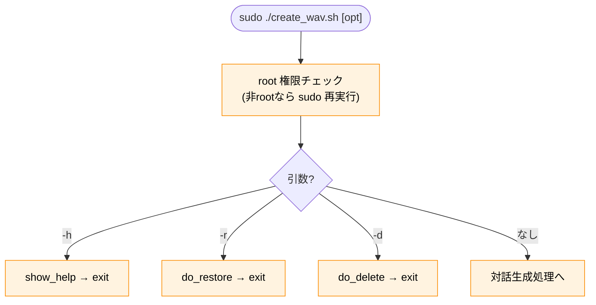
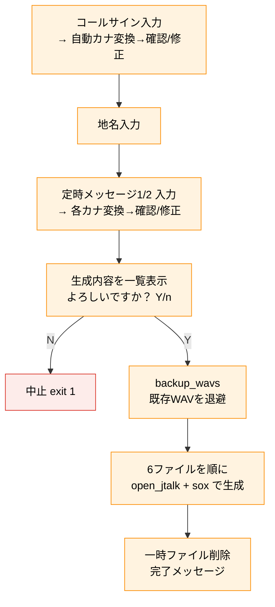

# create_wav.sh ソフトウェア仕様書（JT版 V1.2 / VV版 V1.31vv）

**対象ファイル:** `/opt/dvswitch_bot/bin/create_wav.sh`
**対象バージョン:** JT版（リポジトリ直下）**V1.2** ／ VV版（`dvs_ocv_vv/`）**V1.31vv**
**役割:** コールサイン・地名・定時メッセージを対話入力し、bot が使う固定 WAV を
一括生成する。入力内容を `wav_source.json` に記録して次回のプリフィルと非対話再生成（`--regen`）に使い、上書き前に自動バックアップし、復元（`-r`）・削除（`-d`）にも対応する。
**本文の扱い:** 本文は **JT版・VV版で共通の仕様**（音声合成エンジンを除く）を記述する。VV版（VOICEVOX）固有の差分は末尾の『VV版差分（V1.31vv）』章にまとめる。
**版番号の "vv" サフィックス:** VOICEVOX 系ノード用ファイルであることを示す命名規約（Open JTalk 系 Pi ノード用の同名ファイルと区別する）。

この文書は**スクリプト本体の内部仕様**を記述する技術文書です。日常の操作方法や
音声生成の手順解説は『操作マニュアル』『Voice_generation_manual.md』を参照してください。

---

## 目次

1. [概要と責務](#1-概要と責務)
2. [実行環境・前提](#2-実行環境前提)
3. [定数仕様](#3-定数仕様)
4. [生成する WAV 一覧](#4-生成する-wav-一覧)
5. [コマンドライン仕様](#5-コマンドライン仕様)
6. [関数仕様](#6-関数仕様)
7. [処理フロー](#7-処理フロー)
8. [カナ変換仕様](#8-カナ変換仕様)
9. [音声生成パイプライン](#9-音声生成パイプライン)
10. [バックアップ・復元仕様](#10-バックアップ復元仕様)
11. [既知の注意点](#11-既知の注意点)
12. [改修時の注意点](#12-改修時の注意点)
13. [入力記録とプリフィル・非対話再生成（wav_source.json / --regen）](#13-入力記録とプリフィル非対話再生成wav_source_json----regen)
14. [VV版差分（V1.31vv）](#14-vv版差分v131vv)

---

## 1. 概要と責務

`create_wav.sh` は、bot（dvswitch_bot.py）が読み込む固定 WAV を生成する対話ツール。
次の責務を持つ。

1. **対話入力** — コールサイン・読み仮名・地名・定時メッセージ1/2 を入力
2. **自動カナ変換** — 英数字をカナ読みに変換し、読み仮名のたたき台を提示（修正可）
3. **音声生成** — Open JTalk で合成し、SoX で 8kHz/mono/16bit に変換して出力
4. **自動バックアップ** — 上書き前に既存 WAV を日付フォルダへ退避
5. **復元・削除** — 過去の WAV セットに戻す / バックアップを掃除する

bot は送出のたびに WAV を読み直すため、**生成（上書き）すれば bot の再起動なしで
次の送出から反映**される。

---

## 2. 実行環境・前提

| 項目 | 内容 |
|---|---|
| インタプリタ | `/bin/bash`（`function` 構文・`${var^^}` 等の bash 機能を使用） |
| 権限 | root 必須。非 root 時は `sudo "$0" "$@"` で再実行し `exit $?` |
| 依存コマンド | `open_jtalk` / `sox` / `cp` / `find` / `mkdir` / `chown`（標準＋音声系） |
| 辞書・音声モデル | `naist-jdic` と `mei_normal.htsvoice` が所定パスにあること |

> `dvs_config.sh` が `exec sudo` で自己置換するのに対し、本スクリプトは `sudo "$0"`
> ＋`exit $?` でサブプロセスとして再実行する（挙動は同等）。

---

## 3. 定数仕様

| 変数 | 値 | 意味 |
|---|---|---|
| `DIC_DIR` | `/var/lib/mecab/dic/open-jtalk/naist-jdic` | Open JTalk 辞書 |
| `VOICE_MODEL` | `/usr/share/hts-voice/mei/mei_normal.htsvoice` | 音声モデル（メイ） |
| `OUT_DIR` | `/opt/dvswitch_bot` | WAV 出力先（直下） |
| `TMP_DIR` | `/tmp` | 一時ファイル置き場 |
| `BAK_ROOT` | `/opt/dvswitch_bot/bak/wav` | バックアップ格納先 |
| `WAV_FILES` | 下表6ファイルの配列 | バックアップ／復元の対象 |

### WAV_FILES（バックアップ・復元の対象）

```
fixed_intro.wav  fixed_outro.wav  time_intro.wav  001.wav  002.wav  time_outro.wav
```

`time_outro.wav` は現行 bot で未使用だが、バックアップ・復元の取りこぼしを防ぐため
対象に含めている。

---

## 4. 生成する WAV 一覧

| ファイル | 読み上げ内容 | SoX 無音トリム |
|---|---|---|
| `fixed_intro.wav` | 「こちらは、(コールサイン)、(地名) ディーエムアール デジピーターです。」 | なし |
| `fixed_outro.wav` | 「カーチャンクです。」 | なし |
| `time_intro.wav` | 「こちらは、(コールサイン)、」 | あり |
| `001.wav` | イントロ文＋定時メッセージ1 | あり |
| `002.wav` | イントロ文＋定時メッセージ2 | あり |
| `time_outro.wav` | 「です。」 | なし |

すべて出力先は `OUT_DIR`（`/opt/dvswitch_bot/` 直下）。出力フォーマットは
**8000Hz / モノラル / 16bit PCM**（`sox -r 8000 -c 1 -b 16`）。

> 💡 **カスタム音声（cstm）との関係:** 本スクリプトは上記の**標準 WAV のみ**を生成する。intro/001/002 を差し替えるカスタム音声（`cstm_intro.wav`/`cstm_001.wav`/`cstm_002.wav`、V1.73〜）は利用者が同じフォーマットで用意するもので、本スクリプトの生成・バックアップ対象外。詳細は `カスタム音声.md` 参照。

---

## 5. コマンドライン仕様

| 引数 | 動作 | 呼ぶ関数 |
|---|---|---|
| （なし） | 対話で WAV 生成 | メイン処理（関数化されていない後半部） |
| `-r` | バックアップから復元 | `do_restore` |
| `-d` | バックアップ全削除 | `do_delete` |
| `--regen` | 記録済みの入力内容（`wav_source.json` の `texts`）で全固定 WAV を**非対話再生成** | `do_regen`（第13章） |
| `-h` / `--help` | ヘルプ表示 | `show_help` |
| その他 | エラー＋ヘルプ表示し `exit 1` | — |

`case "${1:-}"` で分岐。引数なし（`""`）のときは `:`（何もしない）で case を抜け、
そのまま下の対話生成処理へ進む。

---

## 6. 関数仕様

| 関数 | 役割 | 戻り値・副作用 |
|---|---|---|
| `show_help` | 使い方を表示 | ヒアドキュメント出力 |
| `backup_wavs` | 既存 WAV を `BAK_ROOT/<日付>/` へ退避＋chown | 対象ゼロならスキップ |
| `do_restore` | 日付フォルダを選んで WAV を戻す（`-r`） | 復元後 `exit 0` |
| `do_delete` | WAV バックアップを全削除（`-d`） | 削除後 `exit 0` |
| `callsign_to_kana(s)` | 英数字をカナへ（数字は英語読み） | echo で返す |
| `msg_alphanum_to_kana(s)` | 英数字をカナへ（数字は日本語読み） | echo で返す |

メインの対話生成処理は関数化されておらず、case 分岐を抜けた後のトップレベルに
直接記述されている（入力→確認→backup_wavs→生成→後始末）。

### 2つのカナ変換関数の違い

| 関数 | 数字の読み | 用途 |
|---|---|---|
| `callsign_to_kana` | 英語読み（ワン/ツー/スリー…） | コールサイン |
| `msg_alphanum_to_kana` | 日本語読み（イチ/ニー/サン…） | 定時メッセージ |

英字（A〜Z）の読みは両者共通。数字だけが異なる。コールサインは無線の習慣で
英語読み、本文メッセージは自然な日本語読み、という使い分け。

---

## 7. 処理フロー

### 7-1. 全体の分岐



### 7-2. 対話生成処理（引数なし）



ポイント: **確認（Y/n）で n 以外を選んで初めて backup＋生成**が走る。生成の直前に
必ずバックアップを取る。

---

## 8. カナ変換仕様

入力の英数字を `case "${char^^}"`（大文字化して判定）で1文字ずつカナに変換する。

### 英字（両関数共通）

A=エー / B=ビー / C=シー / D=ディー / E=イー / F=エフ / G=ジー / H=エイチ /
I=アイ / J=ジェイ / K=ケー / L=エル / M=エム / N=エヌ / O=オー / P=ピー /
Q=キュー / R=アール / S=エス / T=ティー / U=ユー / V=ブイ / W=ダブリュー /
X=エックス / Y=ワイ / Z=ゼット

### 数字（関数で異なる）

| 数字 | callsign_to_kana（英語読み） | msg_alphanum_to_kana（日本語読み） |
|---|---|---|
| 0 | ゼロ | ゼロ |
| 1 | ワン | イチ |
| 2 | ツー | ニー |
| 3 | スリー | サン |
| 4 | フォー | ヨン |
| 5 | ファイブ | ゴー |
| 6 | シックス | ロク |
| 7 | セブン | ナナ |
| 8 | エイト | ハチ |
| 9 | ナイン | キュー |

テーブルに無い文字（日本語・記号など）は、そのまま出力される（`*) kana+="$char"`）。

### 確認・修正の仕組み

`read -ep "..." -i "$AUTO_KANA" 変数` の `-i` で、自動変換結果を入力欄に初期表示する。
そのまま Enter で確定、矢印キーで部分修正もできる。誤変換（地名や特殊な読み）を
人手で直せるようにするための設計。

---

## 9. 音声生成パイプライン

各 WAV は次の2ステップで作る。

```
1. open_jtalk: テキスト → TMP_DIR の生WAV（48kHz）
   echo "テキスト" | open_jtalk -x DIC_DIR -m VOICE_MODEL -ow 生WAV
2. sox: 生WAV → OUT_DIR の最終WAV（8kHz/mono/16bit）
   sox 生WAV -r 8000 -c 1 -b 16 最終WAV [無音トリム]
```

### 無音トリムの有無

`time_intro` / `001` / `002` には、SoX の無音トリムフィルタを付ける。

```
silence 1 0.1 1% reverse silence 1 0.1 1% reverse
```

これは「先頭の無音を削る → 逆再生して再度先頭（＝元の末尾）の無音を削る → 逆に戻す」
ことで**前後の無音を除去**するイディオム。`fixed_intro` / `fixed_outro` /
`time_outro` にはトリムを付けていない。

### 組み立てテキスト

```
BASE_INTRO_TEXT = "こちらは、<コールサイン読み>、<地名> ディーエムアール デジピーターです。"
001 = BASE_INTRO_TEXT + <メッセージ1読み>
002 = BASE_INTRO_TEXT + <メッセージ2読み>
```

`dvswitch_bot.py` がイントロとアウトロを連結する方式とは異なり、本スクリプトは
**完成済みの文を一気に open_jtalk へ渡す**（継ぎ目ノイズを避けるため）。

### 一時ファイル

`temp_intro.wav` / `temp_outro.wav` / `time_intro.wav` / `001_raw.wav` /
`002_raw.wav` / `time_outro.wav`（すべて `TMP_DIR`）。生成完了後に `rm -f` で削除。

---

## 10. バックアップ・復元仕様

### バックアップ（backup_wavs）

| 項目 | 内容 |
|---|---|
| 保存先 | `/opt/dvswitch_bot/bak/wav/<YYMMDDHHMMSS>/` |
| 対象 | `WAV_FILES`（6ファイル）のうち、存在するものだけ |
| 事前チェック | 対象が1つも無ければ「初回作成」としてスキップ（`return 0`） |
| コピー方式 | `cp -p`（属性保持） |
| 所有者 | コピー後に `chown -R ocv:ocv /opt/dvswitch_bot/bak` |
| 呼ばれる契機 | 生成の直前 / 復元の直前（保険） |

### 復元（do_restore, -r）

1. `BAK_ROOT` 内の日付フォルダを新しい順（`sort -r`）で一覧
2. 番号選択（0 でキャンセル、範囲外は中止）
3. **復元前に現状を保険バックアップ**（`backup_wavs`）
4. 選択フォルダ内の各 WAV を `OUT_DIR` へ `cp -p`
5. 「再起動不要」のメッセージを出して `exit 0`

### 削除（do_delete, -d）

`BAK_ROOT` 配下の日付フォルダ数を数え、0 なら何もしない。1つ以上あれば y/N 確認のうえ
`find ... -type d -exec rm -rf {} +` で全削除。

### dvs_config.sh との統一

バックアップ先が `/opt/dvswitch_bot/bak/wav`、`dvs_config.sh` が
`/opt/dvswitch_bot/bak/ini`。両者で `/opt/dvswitch_bot/bak/` 配下に集約し、
オプション体系（`-r`/`-d`/`-h`）・自動バックアップ・復元前保険バックアップの作法を
揃えている。

---

## 11. 既知の注意点

| 注意点 | 内容 |
|---|---|
| **生成は再起動不要で反映** | bot は送出のたびに WAV を読むため、上書きすれば次の送出から反映される |
| **生成中の読み込み衝突** | 生成（上書き）中に bot が同じファイルを送出で読むと、まれに音が乱れる。確実にするなら閑散時か bot 一時停止 |
| **time_outro は未使用** | 生成はするが現行 bot は参照しない（無害） |
| **無音トリムの有無が混在** | time_intro/001/002 はトリムあり、fixed 系はトリムなし。意図的な差 |
| **辞書・音声モデル必須** | パスが違うと open_jtalk が空 WAV を出す。生成前に存在確認を推奨 |

---

## 12. 改修時の注意点

| 項目 | 注意 |
|---|---|
| **出力フォーマット固定** | `-r 8000 -c 1 -b 16` は DMR 送出の要件。変えると bot 側で扱えない |
| **2つのカナ関数** | コールサイン＝英語読み、メッセージ＝日本語読み。統合すると読みが崩れる |
| **無音トリムのイディオム** | `silence ... reverse silence ... reverse` は前後トリムの定型。崩さない |
| **BAK_ROOT の整合** | `/opt/dvswitch_bot/bak/wav`。dvs_config.sh の `ini` と合わせて bak 配下に集約 |
| **chown のユーザ名** | `ocv:ocv` 固定。別ユーザ運用なら要変更 |
| **メイン処理は非関数** | 対話生成はトップレベル記述。関数化されていない点に注意して改修する |
| **完成文を一気に合成** | イントロ＋本文を1テキストで open_jtalk に渡す。継ぎ目ノイズ回避のため分割しない |

---

## 13. 入力記録とプリフィル・非対話再生成（wav_source.json / --regen）

本章は **JT版・VV版で共通**の機能（JT版 V1.0/V1.2、VV版でも同様）を記述する。

### 13-1. 入力内容の記録（wav_source.json）

対話生成の完了時に、入力原文・読み仮名・最終的な合成テキストを `/opt/dvswitch_bot/wav_source.json` に記録する（V1.0〜）。この JSON は「どんな内容で WAV を作ったか」の唯一の記録であり、次項のプリフィルと `--regen` の入力源になる。

### 13-2. 次回起動時のプリフィル

対話生成を起動すると、`wav_source.json` に記録済みの前回入力値を読み込み、各プロンプトの既定値（プリフィル）として提示する（V1.0〜）。前回と同じ項目は Enter で確定でき、変更したい項目だけ打ち直せばよい。

### 13-3. 非対話再生成（`--regen`）

`sudo ./create_wav.sh --regen` は、記録済みの `texts`（最終合成テキスト）で **全固定 WAV を対話なしで作り直す**（`do_regen`、JT版 V1.2〜／VV版）。ダッシュボードからの再生成や、合成ヘルパ差し替え後の作り直しに使う入口。`texts` は書き換えず `generated_at` のみ更新する。

### 13-4. バックアップ対象

上書き（生成）の直前に、既存の `*.wav` **および `wav_source.json`** を `/opt/dvswitch_bot/bak/wav/YYMMDDHHMMSS/` へ自動退避する。復元（`-r`）時は WAV と併せて入力記録も世代単位で戻せる。

---

## 14. VV版差分（V1.31vv）

本章は **VV版（`dvs_ocv_vv/create_wav.sh` V1.31vv）** に固有の差分のみを記述する。第1〜13章の共通仕様のうち、音声合成エンジンと話者選択に関わる部分が VV版では次のとおり異なる。

> 版番号の `vv` サフィックスは VOICEVOX 系ノード用ファイルであることを示す命名規約（Open JTalk 系 Pi ノード用の同名ファイルと区別する）。

### 14-1. 最前段の話者選択（VOICEVOX 全話者スキャン）

対話セッションの **最前段**で、環境の VOICEVOX 全話者（`/opt/voicevox/dist/models/vvms/*.vvm`）をスキャンし、`style_id` 昇順の一覧を提示して番号で選ばせる（V1.2vv〜）。前回選択した話者を既定（プリフィル）とする。VOICEVOX の読み込み・スキャンに失敗した場合は選択をスキップし、既定話者 **No.7（アナウンス）= `style_id 30` / `6.vvm`** で続行する（WAV 生成自体は止めない）。

### 14-2. 選択話者の wav_source.json への保存

選択結果（`style_id` / `vvm` 等）を `wav_source.json` の `"voice"` に保存する。この `"voice"` は固定 WAV 側（本スクリプト → `vv_say.py`）と bot の動的合成（`dvswitch_bot.py`）が **共有**し、両系統の話者が揃う。

### 14-3. vv_say.py への style_id / vvm の明示引数渡し

合成時、選択話者を `vv_say.py` に **明示引数**（`style_id` / `vvm`）で渡す（🔴 V1.31vv の修正点）。V1.3avv までは `vv_say.py` が保存前の古い `wav_source.json` から `voice` を読むため、話者を変更しても固定 WAV が旧話者のまま生成される不具合（「テキストは新しいのに声だけ古い」実機症状）があり、明示引数渡しで解消した。合成パイプラインは `vv_say.py`（VOICEVOX）で WAV を生成し、SoX で 8kHz / mono / 16bit に変換する（Open JTalk サブプロセスは使わない）。

### 14-4. 完了時の bot 再起動プロンプト（話者変更時のみ）

対話モードの末尾で、**話者が変わった場合のみ** `dvswitch-bot` の再起動を `y/N` で確認して実行する（V1.31vv〜）。bot は `voice` を起動時にのみ読むため、再起動忘れによる「固定 WAV は新話者・動的合成は旧話者」の混在を防ぐ。固定 WAV 自体は送出のたびに読み直されるため再起動なしで反映される。`--regen` 経路は `wav_source.json` 更新 → 再生成 → 話者変更判定で自動再起動されるため、この対話確認の対象外。

---

*create_wav.sh ソフトウェア仕様書（JT版 V1.2 / VV版 V1.31vv）*
*対象: /opt/dvswitch_bot/bin/create_wav.sh（JT版 リポジトリ直下 V1.2 ／ VV版 dvs_ocv_vv/ V1.31vv、バックアップ先 /opt/dvswitch_bot/bak/wav）*
*Contributors: JA2CCV / JI2TAB / JJ2YYK / OpenCCVoice Contributors*
