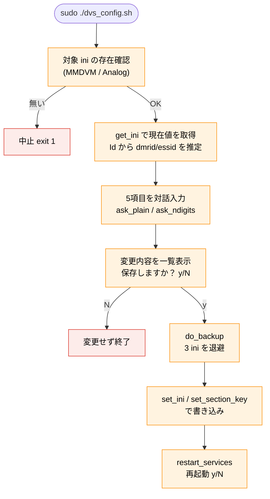

# dvs_config.sh ソフトウェア仕様書

**対象ファイル:** `/opt/dvswitch_bot/bin/dvs_config.sh`
**対象バージョン:** **V1.1**（JT版 / JTW版 / VV版 / VVW版で同一内容）
**役割:** TGIF 接続を前提に、DVSwitch の3つの ini ファイルの可変項目を対話入力で更新する
設定ツール。編集前に自動バックアップし、復元（`-r`）・削除（`-d`）にも対応する。

この文書は**スクリプト本体の内部仕様**を記述する技術文書です。システム全体の構成や
日常の操作方法は『システム仕様書』『操作マニュアル』を参照してください。

---

## 目次

1. [概要と責務](#1-概要と責務)
2. [実行環境・前提](#2-実行環境前提)
3. [定数仕様](#3-定数仕様)
4. [対象 ini と変更項目](#4-対象-ini-と変更項目)
5. [コマンドライン仕様](#5-コマンドライン仕様)
6. [関数仕様](#6-関数仕様)
7. [処理フロー](#7-処理フロー)
8. [ini 書き換えロジック](#8-ini-書き換えロジック)
9. [バックアップ・復元仕様](#9-バックアップ復元仕様)
10. [入力検証仕様](#10-入力検証仕様)
11. [既知の制約](#11-既知の制約)
12. [改修時の注意点](#12-改修時の注意点)

---

## 1. 概要と責務

`dvs_config.sh` は、DVSwitch を TGIF ネットワークに接続して運用するための ini 設定を、
対話形式で安全に編集するツール。次の責務を持つ。

1. **可変項目の対話入力** — コールサイン・DMR ID・ESSID・TGIF パスワード・送信 TG
2. **固定値の自動設定** — TGIF 運用で必須の値（Enable, Address, USRP ポート等）を強制
3. **編集前の自動バックアップ** — 3つの ini を日付フォルダへ退避
4. **復元・削除** — 過去のバックアップから戻す / バックアップを掃除する
5. **サービス再起動** — 編集・復元後に analog_bridge / mmdvm_bridge を再起動（確認つき）

設計方針は「**既存のキー行の値だけを置換する**」点にあり、ini の構造（セクション・
コメント・他のキー）は壊さない。

---

## 2. 実行環境・前提

| 項目 | 内容 |
|---|---|
| インタプリタ | `/bin/bash`（`set -u` で未定義変数をエラー化） |
| 権限 | root 必須。非 root 時は `exec sudo "$0" "$@"` で自己昇格 |
| 依存コマンド | `grep` / `sed` / `awk` / `cp` / `find` / `systemctl` / `chown`（すべて標準） |
| 対象ホスト | DVSwitch-Server 導入済みの Raspberry Pi / x86_64 Linux（実ユーザ名は不問。V1.1 で `ocv` 固定を廃止） |

`set -u` により、未定義変数を参照するとスクリプトが即停止する（バグの早期発見）。

---

## 3. 定数仕様

### ファイルパス

| 変数 | 値 |
|---|---|
| `MMDVM_INI` | `/opt/MMDVM_Bridge/MMDVM_Bridge.ini` |
| `DVSWITCH_INI` | `/opt/MMDVM_Bridge/DVSwitch.ini` |
| `ANALOG_INI` | `/opt/Analog_Bridge/Analog_Bridge.ini` |
| `TARGET_FILES` | 上記3つの配列（バックアップ対象） |
| `BAK_ROOT` | `/opt/dvswitch_bot/bak/ini`（バックアップ格納先） |

### 固定値（TGIF 運用で強制セットする値）

| 変数 | 値 | 反映先 |
|---|---|---|
| `FIX_ADDRESS` | `tgif.network` | MMDVM `[DMR Network] Address` |
| `FIX_USRP_TXPORT` | `51001` | Analog `[USRP] txPort` |
| `FIX_USRP_RXPORT` | `51000` | Analog `[USRP] rxPort` |
| `FIX_USRP_AUDIO` | `AUDIO_USE_GAIN` | Analog `[USRP] usrpAudio` |
| `FIX_TLV_AUDIO` | `AUDIO_USE_GAIN` | Analog `[USRP] tlvAudio` |

これらは対話入力させず、スクリプトが常に上書きする。TGIF 接続で動作させるための
必須設定であり、運用者が誤って変えないようにするため固定化している。

---

## 4. 対象 ini と変更項目

### 対話入力する可変項目（5つ）

| 入力 | 検証 | 反映先 |
|---|---|---|
| callsign | 自由文字列 | MMDVM `Callsign` |
| dmrid | 7桁数字 | MMDVM `Id`（先頭7桁）、Analog `gatewayDmrId`、`repeaterID`（先頭7桁） |
| essid | 2桁数字 | MMDVM `Id`（末尾2桁）、Analog `repeaterID`（末尾2桁） |
| tgifpassword | 自由文字列 | MMDVM `Password` |
| txtgif | 自由文字列 | Analog `txTg` |

> `Id` と `repeaterID` は `dmrid(7桁) + essid(2桁) = 9桁` を連結した値になる。
> 例: dmrid=4402519, essid=11 → `440251911`

### スクリプトが固定値でセットする項目

| ini | セクション | キー | 値 |
|---|---|---|---|
| MMDVM | `[DMR]` | `Enable` | `1` |
| MMDVM | `[DMR Network]` | `Enable` | `1` |
| MMDVM | `[DMR Network]` | `Address` | `tgif.network` |
| Analog | `[USRP]` | `txPort` | `51001` |
| Analog | `[USRP]` | `rxPort` | `51000` |
| Analog | `[USRP]` | `usrpAudio` | `AUDIO_USE_GAIN` |
| Analog | `[USRP]` | `tlvAudio` | `AUDIO_USE_GAIN` |

### DVSwitch.ini の扱い

`DVSwitch.ini` は**バックアップ対象だが、値の変更は行わない**（退避のみ）。

---

## 5. コマンドライン仕様

| 引数 | 動作 | 呼ぶ関数 |
|---|---|---|
| （なし） | 対話編集 | `do_edit` |
| `-r` | バックアップから復元 | `do_restore` |
| `-d` | バックアップ全削除 | `do_delete` |
| `-h` / `--help` | ヘルプ表示 | `show_help` |
| その他 | エラー＋ヘルプ表示し `exit 1` | — |

末尾の `case "${1:-}"` で分岐する。`${1:-}` は引数が無くても `set -u` でエラーに
ならないための記法。

---

## 6. 関数仕様

| 関数 | 役割 | 備考 |
|---|---|---|
| `restart_services` | analog_bridge / mmdvm_bridge を y/N 確認のうえ再起動 | 編集・復元の最後に呼ぶ |
| `show_help` | 使い方を表示 | ヒアドキュメント |
| `do_backup` | 3つの ini を `BAK_ROOT/<日付>/` へ退避＋`chown_owner` | 編集・復元の前に呼ぶ |
| `chown_owner([opts,]path...)` | 生成物の所有者を実ユーザーへ戻す（V1.1 で新設） | `$SUDO_USER` → UID 1000 の順で解決。失敗時は WARN のみ |
| `set_ini(file,key,val)` | セクション無関係に「最初に一致するキー行」を置換 | sed 使用 |
| `set_section_key(file,sec,key,val)` | 指定セクション内のキー行のみ置換 | awk 使用 |
| `is_ndigits(val,n)` | val が n 桁数字かを判定 | 戻り値で真偽 |
| `ask_plain(prompt,cur)` | 自由入力（現在値をプリフィル） | 結果は `REPLY_VAL` |
| `ask_ndigits(prompt,cur,n)` | n 桁数字を検証しながら入力 | 不正なら再入力 |
| `get_ini(file,key)` | ini から現在値を取得（行末コメント除去） | echo で返す |
| `guess_dmrid(v)` | 9桁 Id から先頭7桁を推定 | 9桁でなければ空 |
| `guess_essid(v)` | 9桁 Id から末尾2桁を推定 | 9桁でなければ空 |
| `do_edit` | 対話編集の本体 | 既定動作 |
| `do_restore` | 復元の本体 | `-r` |
| `do_delete` | バックアップ削除の本体 | `-d` |

`ask_plain` / `ask_ndigits` は結果をグローバル変数 `REPLY_VAL` に格納する方式
（bash の関数は戻り値で文字列を返せないため）。

---

## 7. 処理フロー

### 7-1. 対話編集（do_edit）



ポイント: **確認（y/N）で y を選んで初めてバックアップ＋書き込み**が走る。N なら
ファイルには一切触れない。書き込みの直前に必ずバックアップを取る。

### 7-2. 復元（do_restore）

1. `BAK_ROOT` 内の日付フォルダを新しい順（`sort -r`）で一覧表示
2. 番号を選択（0 でキャンセル）
3. **復元前に現状を保険バックアップ**（`do_backup`）
4. 選択フォルダ内の各 ini を、対応する本番パスへ `cp -p`
5. `restart_services`

ファイル名から復元先を決める（`MMDVM_Bridge.ini`→`$MMDVM_INI` 等）case 分岐を持つ。

### 7-3. 削除（do_delete）

`BAK_ROOT` 配下を確認 → y/N 確認 → `rm -rf "${BAK_ROOT:?}/"*` で全削除。
`${BAK_ROOT:?}` は、変数が空のときにエラーで止める安全装置（`rm -rf /*` の暴発防止）。

---

## 8. ini 書き換えロジック

### set_ini（セクション非依存）

```
^[[:space:]]*KEY[[:space:]]*=  にマッチする最初の行の右辺を置換
```

`grep -Eq` で存在確認し、あれば `sed -i -E` で `\1（キー=まで）+ 新値` に置換。
キーが見つからなければ `[WARN]` を出して**何もしない**（新規追加はしない）。

用途: `Callsign` / `Id` / `Password` / `gatewayDmrId` / `repeaterID` / `txTg` のように、
ファイル内で一意なキー。

### set_section_key（セクション限定）

awk で「指定セクション `[XXX]` に入ってから、最初に一致したキー行のみ」を置換する。
元のインデント（先頭空白）は保持する。同名キーが複数セクションにある場合に、
**狙ったセクションだけ**を変更するために使う。

用途: `[DMR] Enable` と `[DMR Network] Enable` のように、同じ `Enable` でも
セクションごとに意味が違うもの、`[USRP]` 配下のポート類。

> **使い分けの理由:** `Enable` のようなキーは複数セクションに存在するため、
> 単純な `set_ini`（最初の一致）では誤ったセクションを書き換える危険がある。
> セクションを限定したい項目には `set_section_key` を使う。

---

## 9. バックアップ・復元仕様

### バックアップ（do_backup）

| 項目 | 内容 |
|---|---|
| 保存先 | `/opt/dvswitch_bot/bak/ini/<YYMMDDHHMMSS>/` |
| 対象 | `TARGET_FILES`（3つの ini）。存在するものだけコピー |
| コピー方式 | `cp -p`（タイムスタンプ・属性を保持） |
| 所有者 | コピー後に `chown_owner -R /opt/dvswitch_bot/bak`（sudo 実行で root 所有化するのを防ぐ）。V1.1 で `ocv:ocv` 決め打ちを廃止し、`$SUDO_USER` → UID 1000 の順で実ユーザーを解決してその既定グループへ揃える |
| 呼ばれる契機 | 編集の書き込み直前 / 復元の直前（保険） |

### フォルダ命名

`date +%y%m%d%H%M%S`（例: `260605103000` ＝ 2026-06-05 10:30:00）。
辞書順＝時系列順になるため、`sort -r` で新しい順に並べられる。

### 復元の安全性

復元時も**先に現状をバックアップ**してから上書きするため、「復元したが、やはり
元に戻したい」という場合も直前の状態に戻せる。

---

## 10. 入力検証仕様

| 関数 | 検証内容 |
|---|---|
| `is_ndigits(v,n)` | `v` が `^[0-9]+$` かつ長さ `n` |
| `ask_ndigits` | `is_ndigits` を満たすまでループ（dmrid=7桁、essid=2桁） |
| `ask_plain` | 検証なし（自由入力。現在値をプリフィル） |

`read -ep "..." -i "$cur" a` の `-i` で現在値を初期表示し、Enter でそのまま維持できる。

### 現在値の推定

`get_ini` で現在の `Id`（9桁）を取得し、`guess_dmrid`（先頭7桁）/ `guess_essid`
（末尾2桁）で分解して、対話のデフォルト値に使う。`Id` が9桁でない場合は、
Analog の `gatewayDmrId` をフォールバックに使う。

---

## 11. 既知の制約

| 制約 | 内容 |
|---|---|
| 既存キー行のみ対象 | 値の置換は「既に存在するキー行」が対象。コメントアウト行（`;key=...`）は対象外で、新規キー追加もしない |
| セクション限定置換 | `Enable` / `Address` / USRP 系はセクションを限定して置換する |
| 行末コメント非保持 | `キー=値` のみ書き換えるため、その行に付いていた行末コメントは保持されない |
| DVSwitch.ini は不変更 | バックアップ対象だが、本ツールでは値を変更しない |
| 実ユーザは1人前提 | `chown` 先は `$SUDO_USER` → UID 1000 の順で決まる（V1.1）。root 以外の実ユーザが複数いる構成は想定外。どちらも取れない場合は所有者変更をスキップし WARN を出す |

---

## 12. 改修時の注意点

| 項目 | 注意 |
|---|---|
| **固定ポートの一致** | `FIX_USRP_RXPORT(51000)` は dvswitch_bot.py の `UDP_PORT` と一致が前提。変えるなら両方 |
| **set_ini と set_section_key の使い分け** | 一意キーは `set_ini`、複数セクションに同名があるキーは `set_section_key`。間違えると別セクションを壊す |
| **${BAK_ROOT:?} を外さない** | `do_delete` の `rm -rf "${BAK_ROOT:?}/"*` の `:?` は空変数暴発防止。絶対に外さない |
| **バックアップ先の整合** | `BAK_ROOT` は `/opt/dvswitch_bot/bak/ini`。create_wav.sh の `wav` と合わせて `/opt/dvswitch_bot/bak/` 配下に集約している |
| **chown の引数順** | `chown_owner` は `chown "${OWNER_USER}:" "$@"` の順で呼ぶこと。対象を先に書くと chown がそれをユーザ名と解釈して `invalid user` で失敗する（create_wav.sh V1.1〜V1.2/V1.31vv に実在したバグ）。エラーを `2>/dev/null` で握りつぶさないこと |
| **新規キー追加はしない設計** | キーが無いと `[WARN]` で素通り。ini にキーが存在することが前提（DVSwitch 標準 ini を想定） |

---

*dvs_config.sh ソフトウェア仕様書*
*対象: /opt/dvswitch_bot/bin/dvs_config.sh（TGIF 接続前提・バックアップ先 /opt/dvswitch_bot/bak/ini）*
*Contributors: JA2CCV / JI2TAB / JJ2YYK / OpenCCVoice Contributors*
