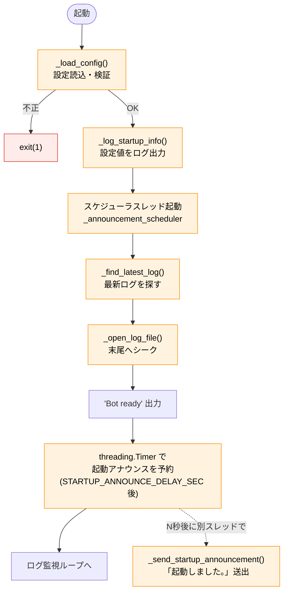
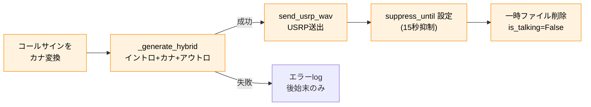

# dvswitch_bot.py ソフトウェア仕様書（V1.73）

**対象ファイル:** `/opt/dvswitch_bot/bin/dvswitch_bot.py`
**バージョン:** V1.73（時刻案内モード・送出音量・カスタム音声に対応）
**役割:** MMDVM_Bridge のログを監視し、カーチャンク自動応答・時報・定時メッセージを
USRP プロトコルで送出する常駐デーモン。

この文書は**スクリプト本体の内部仕様**を記述する技術文書です。システム全体の構成
（各ソフトの関係・配線）は別冊『システム仕様書』を参照してください。

---

## 目次

1. [概要と責務](#1-概要と責務)
2. [依存・実行環境](#2-依存実行環境)
3. [定数仕様](#3-定数仕様)
4. [設定ファイルと検証仕様](#4-設定ファイルと検証仕様)
5. [グローバル状態と排他制御](#5-グローバル状態と排他制御)
6. [関数仕様](#6-関数仕様)
7. [処理フロー](#7-処理フロー)
8. [USRP パケット仕様](#8-usrp-パケット仕様)
9. [音声生成パイプライン](#9-音声生成パイプライン)
10. [ナイトモード仕様](#10-ナイトモード仕様)
11. [ログ出力仕様](#11-ログ出力仕様)
12. [スレッド構成と終了処理](#12-スレッド構成と終了処理)
13. [改修時の注意点](#13-改修時の注意点)

---

## 1. 概要と責務

`dvswitch_bot.py` は単一プロセスの常駐デーモンで、次の処理を行う。

1. **起動アナウンス** — 起動後、一定秒数おいて「起動しました。」を1回送出（V1.62 で追加）
2. **カーチャンク自動応答** — MMDVM_Bridge ログから短時間送信を検知し、応答音声を送出
3. **時報** — 毎正時に「〇〇時です」を送出（ナイトモード突入時はアナウンスも）
4. **定時メッセージ** — 1時間に 1〜3 回、001/002 を交互送出

入出力の境界は次のとおり。

| 区分 | 内容 |
|---|---|
| 入力 | MMDVM_Bridge ログ（`/var/log/mmdvm/`）、設定 JSON、固定 WAV 群 |
| 出力 | USRP パケット（UDP 127.0.0.1:51000 → Analog_Bridge） |
| 外部プロセス起動 | `open_jtalk`（音声合成）、`sox`（音声変換） |
| 対話 | なし（設定は JSON 読み込みのみ。systemd 常駐向け） |

---

## 2. 依存・実行環境

### 標準ライブラリ

`os` / `sys` / `json` / `time` / `glob` / `re` / `socket` / `struct` / `wave` /
`signal` / `logging` / `threading` / `subprocess` / `datetime`

すべて Python 3 標準。**サードパーティ製パッケージへの依存はない。**

### 外部コマンド（PATH 上に必要）

| コマンド | 用途 |
|---|---|
| `open_jtalk` | テキスト → 48kHz WAV の音声合成 |
| `sox` | 8kHz/mono/16bit への変換、無音パディング、WAV 連結 |

### 必要なファイル・ディレクトリ

| パス | 必須 | 用途 |
|---|---|---|
| `/opt/dvswitch_bot/bot_config.json` | ◎ | 動作設定（無いと起動拒否） |
| `/opt/dvswitch_bot/fixed_intro.wav` ほか | ◎ | 固定 WAV 群 |
| `/var/lib/mecab/dic/open-jtalk/naist-jdic` | ◎ | Open JTalk 辞書 |
| `/usr/share/hts-voice/mei/mei_normal.htsvoice` | ◎ | 音声モデル |
| `/var/log/mmdvm/MMDVM_Bridge-*.log` | ◎ | 監視対象ログ |
| `/dev/shm/` | ◎ | 一時 WAV（RAM ディスク） |

---

## 3. 定数仕様

### パス・ネットワーク

| 定数 | 値 | 意味 |
|---|---|---|
| `LOG_DIR` | `/var/log/mmdvm` | ログ格納ディレクトリ |
| `LOG_PATTERN` | `MMDVM_Bridge-*.log` | 監視対象ログのグロブパターン |
| `UDP_IP` | `127.0.0.1` | 送信先（Analog_Bridge） |
| `UDP_PORT` | `51000` | 送信先ポート（Analog の rxPort と一致） |
| `MY_CALLSIGN` | `JJ2YYK` | 自局。これと一致する送信は無視（ループ防止） |
| `DICT_PATH` | `/var/lib/mecab/dic/open-jtalk/naist-jdic` | Open JTalk 辞書 |
| `VOICE_PATH` | `/usr/share/hts-voice/mei/mei_normal.htsvoice` | 音声モデル |
| `BOT_DIR` | `/opt/dvswitch_bot` | WAV・JSON の基準ディレクトリ |
| `CONFIG_PATH` | `{BOT_DIR}/bot_config.json` | 設定ファイル |

### 固定 WAV

| 定数 | ファイル |
|---|---|
| `FIXED_INTRO_WAV` | `fixed_intro.wav`（カーチャンク応答イントロ） |
| `FIXED_OUTRO_WAV` | `fixed_outro.wav`（カーチャンク応答アウトロ） |
| `TIME_INTRO_WAV` | `time_intro.wav`（時報イントロ） |
| `TIME_OUTRO_WAV` | `time_outro.wav`（定義のみ。現行ロジックで未使用） |
| `MSG_FILES` | `[001.wav, 002.wav]`（定時メッセージ） |

### カスタム WAV（V1.73〜）

標準 WAV の代わりに利用者が用意する差し替え音声。`USE_CSTM_*` が True かつ実ファイルが存在するときだけ使い、無ければ標準へフォールバックする（`_resolve_wav` 参照）。

| 定数 | ファイル |
|---|---|
| `CSTM_INTRO_WAV` | `cstm_intro.wav`（intro の差し替え。3か所共通） |
| `CSTM_MSG_FILES` | `[cstm_001.wav, cstm_002.wav]`（001/002 の差し替え） |

### 一時ファイル（PID 付き・/dev/shm）

| 定数 | パス |
|---|---|
| `TEMP_FINAL` | `/dev/shm/reply_final_{PID}.wav`（送出する完成品） |
| `TEMP_48K` | `/dev/shm/tmp_48k_{PID}.wav`（open_jtalk 出力） |
| `TEMP_8K` | `/dev/shm/tmp_8k_{PID}.wav`（8kHz 変換後） |
| `TEMP_INTRO_PADDED` | `/dev/shm/tmp_intro_padded_{PID}.wav`（無音付与後イントロ） |

PID を付けるのは、複数プロセスや再起動時のファイル衝突を避けるため。

### タイミング

| 定数 | 値 | 意味 |
|---|---|---|
| `EMPTY_HEADER_THRESHOLD_SEC` | `0.1` | （予約的定数） |
| `SUPPRESS_DURATION_SEC` | `15.0` | 応答後・通常QSO後の抑制時間（秒） |
| `PACKET_INTERVAL` | `0.02` | USRP パケット送信間隔（20ms） |
| `PRE_POST_PADDING_PACKETS` | `75` | 音声前後の無音パケット数（75×20ms＝1.5秒） |
| `ROTATION_CHECK_INTERVAL` | `5.0` | ログ切替チェック間隔（秒） |
| `GAP_AFTER_INTRO_SEC` | `0.5` | イントロ後の無音（連結時の「間」） |
| `STARTUP_ANNOUNCE_DELAY_SEC` | `5.0` | 起動後この秒数おいて起動アナウンスを送出（V1.62） |
| `TIME_SIGNAL_LEAD_SEC` | `7` | 時報を正時の何秒前に発火させるか |
| `NIGHT_ANN_GAP_SEC` | `1.0` | 時報とナイトモードアナウンスの間隔 |

> **注:** 実際の定数は `5.0`。MMDVM_Bridge / Analog_Bridge の起動が
> 落ち着いてから送出する意図のため、環境に応じてこの値を調整してよい。

### カナ変換テーブル `CHAR_TO_KANA`

英大文字 A〜Z、数字 0〜9、記号 `-`（ダッシュ）`/`（スラッシュ）を日本語カナ読みへ
マップする辞書。コールサインを1文字ずつ読み上げるために使用（例: `JJ2YYK` →
ジェイジェイツーワイワイケー）。テーブルに無い文字はそのまま使われる。

---

## 4. 設定ファイルと検証仕様

設定は `bot_config.json` から `_load_config()` が読み込む。**フェイルセーフ設計**で、
不備があれば誤動作させず `sys.exit(1)` で停止する。

### 必須キー `REQUIRED_KEYS`

| キー | 型 | 検証ルール |
|---|---|---|
| `RX_DURATION_MIN_SEC` | float | `> 0` かつ `< MAX` |
| `RX_DURATION_MAX_SEC` | float | `MIN < MAX` |
| `ANNOUNCE_FREQ` | int | `1 / 2 / 3` のいずれか |
| `NIGHT_MODE_ENABLED` | bool | `true / false`（厳密に bool 型であること） |
| `NIGHT_START_HOUR` | int | `0〜23` |
| `NIGHT_END_HOUR` | int | `0〜23` |

### 任意キー（`REQUIRED_KEYS` に含めない・後方互換）

未設定でも起動できる任意キー。旧設定ファイルとの互換のため必須化していない。

| キー | 型 | 既定 | 意味 |
|---|---|---|---|
| `TIME_SIGNAL_MODE` | int | 1 | 時刻案内モード（0=なし / 1=毎正時 / 2=毎正時+毎30分）。V1.64〜 |
| `TX_GAIN` | float | 1.0 | 送出音量の線形倍率（0.0超〜5.0以下）。不正値は 1.0 にフォールバック。V1.68〜 |
| `USE_CSTM_INTRO` | bool | false | intro にカスタム音声を使う。V1.73〜 |
| `USE_CSTM_001` | bool | false | 001 にカスタム音声を使う。V1.73〜 |
| `USE_CSTM_002` | bool | false | 002 にカスタム音声を使う。V1.73〜 |

> 任意キーは検証で欠落してもエラーにせず既定値を採用する。`USE_CSTM_*` は bool 以外（不正値含む）を安全側に false（標準）として扱い、起動は止めない。

### 検証段階（順に実施し、いずれか失敗で即終了）

1. ファイル存在確認（無ければ終了）
2. JSON パース（失敗で終了）
3. オブジェクト（dict）であることの確認
4. 必須キーの存在確認（欠落キーを列挙して終了）
5. 型変換と範囲チェック（上表のルール）
6. 全通過したらグローバルへ反映し、`Config loaded` をログ出力

> **設計意図:** 設定不備で意図しない送信パラメータのまま電波を出すことを防ぐ。
> systemd では `Restart=on-failure` のため、設定不備時は再起動を繰り返し、
> 運用者が異常に気づける。

---

## 5. グローバル状態と排他制御

| 変数 | 型 | 役割 |
|---|---|---|
| `should_exit` | bool | 終了フラグ。シグナルで `True` になり全ループが抜ける |
| `suppress_until` | float | この `monotonic` 時刻まで応答を抑制 |
| `is_talking` | bool | 送出中フラグ。多重送出を防ぐ |
| `_reply_lock` | Lock | `is_talking` を保護する排他ロック |
| `RX_DURATION_MIN_SEC` ほか6個 | — | 設定値。起動時は `None`、`_load_config()` で確定 |

`is_talking` により、**応答・時報・定時メッセージは同時に1つしか走らない**
（カーチャンク中に時報が重なっても、後発はスキップされる）。

---

## 6. 関数仕様

| 関数 | 役割 | 主な戻り値・副作用 |
|---|---|---|
| `_fmt(tag, action, target, extra)` | ログ行を整形 | 整形済み文字列 |
| `_fatal_config(msg)` | 設定エラーを出力し `exit(1)` | プロセス終了 |
| `_load_config()` | JSON 読込・検証・グローバル反映 | 不正なら `exit(1)` |
| `_resolve_wav(use_cstm, cstm_path, fixed_path, label)` | カスタム使用フラグと実ファイルの有無から実際に再生するパスを決める（V1.73） | カスタム有効＆存在→cstm、無ければ標準＋警告ログ。送出のたびに判定 |
| `_handle_signal(signum, frame)` | SIGTERM/SIGINT で `should_exit=True` | 終了開始 |
| `send_usrp_wav_with_padding(wav_path)` | WAV を USRP 送信（前後パディング＋絶対時刻同期） | UDP 送信。末尾で PTT OFF |
| `_is_night_suppressed(hour)` | 時報の抑制判定 | bool |
| `_is_night_suppressed_message(hour)` | 定時メッセージの抑制判定 | bool |
| `_get_trigger_minutes()` | 放送回数→発火する分のリスト | `[30]`/`[20,40]`/`[15,30,45]` |
| `_announcement_scheduler()` | 時報・定時の発火を監視（別スレッド） | `_start_worker` を呼ぶ |
| `_start_worker(mode, val, extra)` | 多重チェックして応答スレッド起動 | `is_talking` 制御 |
| `_send_startup_announcement()` | 起動アナウンス送出（V1.62。`_start_worker` を経由せず直接実行） | USRP 送信＋一時ファイル削除 |
| `_send_night_mode_announcement()` | ナイトモード突入アナウンス送出 | USRP 送信 |
| `_reply_executor(mode, val, extra)` | 応答の実体（合成→送出→後始末） | 一時ファイル削除、抑制設定 |
| `_generate_hybrid(intro, middle_text, outro)` | イントロ＋合成音声＋アウトロを結合 | bool（成功/失敗） |
| `_log_startup_info()` | 起動時に設定値をログ出力 | — |
| `_find_latest_log()` | 最新ログファイルのパスを返す | パス or None |
| `_open_log_file(path)` | ログを開いて末尾へシーク | (file, inode) |
| `monitor_and_reply()` | メイン。ログ監視ループ | プログラム全体の駆動 |

### モード（`_reply_executor` の `mode` 引数）

| mode | 内容 | 音声構成 |
|---|---|---|
| `kerchunk` | カーチャンク応答 | イントロ＋「〇〇局の、」＋アウトロ |
| `time_signal` | 時報 | 時報イントロ＋「〇〇時です」 |
| `fixed_file` | 定時メッセージ | 既成 WAV（001/002）をそのまま送出 |

---

## 7. 処理フロー

### 7-1. 起動シーケンス（monitor_and_reply）



`Bot ready` 出力の直後に `threading.Timer(STARTUP_ANNOUNCE_DELAY_SEC, _send_startup_announcement)`
で起動アナウンスを予約する。Timer は別スレッドで発火するため、メインのログ監視ループは
待たずに続行する。

### 7-2. ログ監視ループ（カーチャンク検知）

行を1行ずつ読み、正規表現でマッチさせる。

| パターン | 正規表現 | 意味 |
|---|---|---|
| 開始 | `received network voice header from ([A-Z0-9/\-]+)` | 送信開始＋コールサイン |
| 終了 | `received network end of voice transmission` | 送信終了 |
| 時刻 | `(\d{4}-\d{2}-\d{2} \d{2}:\d{2}:\d{2}\.\d{3})` | ログのタイムスタンプ |

**判定ロジック:**

1. 開始行を検知 → コールサイン（`MY_CALLSIGN` 以外）と開始時刻を記憶
2. 終了行を検知 → 受信時間 `dur = 終了 − 開始` を算出
3. 受信時間で分岐:

| 条件 | 動作 |
|---|---|
| `MIN ≤ dur < MAX` かつ抑制時間外 | **カーチャンク**と判定し応答（`_start_worker("kerchunk")`） |
| `MIN ≤ dur < MAX` かつ抑制中 | 残り抑制時間をログに出して無視 |
| `dur ≥ MAX` | **通常QSO**とみなし、以後 `SUPPRESS_DURATION_SEC` 抑制 |
| `dur < MIN` | 短すぎ→無視 |

> 受信時間は **ログのタイムスタンプ差**で測る（MMDVM のフレーム数ベースの長さとは
> 異なる）。検知窓（MIN/MAX）はこの前提で設定する。

### 7-3. 応答実行（_reply_executor, kerchunk の例）



### 7-4. 起動アナウンス（_send_startup_announcement, V1.62）

デーモン起動後、ログ監視を開始する直前に `threading.Timer` で
`STARTUP_ANNOUNCE_DELAY_SEC`（5.0 秒）遅延させ、「起動しました。」を**1回だけ**送出する。

- **目的:** MMDVM_Bridge / Analog_Bridge の起動が落ち着いてから送出するため、固定の遅延を置く
- **実装上のポイント:** `is_talking` フラグや `_reply_lock` と競合しないよう、`_start_worker` を
  **経由せず** `_send_startup_announcement()` を直接呼ぶ。Timer 発火時にちょうど起動直後で
  他の送出と重なりにくいため、専用に直接実行する設計
- **音声:** `_generate_hybrid(FIXED_INTRO_WAV, "起動しました。", None)` で生成（アウトロなし）
- **後始末:** `_reply_executor` の finally と同等に、一時ファイル（TEMP_FINAL ほか）を削除する
- **中断時:** Timer 発火時に `should_exit` が立っていれば何もせず return する

> 起動アナウンスは `is_talking` を立てないため、理論上は起動直後のカーチャンク応答と
> 重なりうるが、起動直後の数秒に応答が走る可能性は低く、実用上の問題はない。

---

## 8. USRP パケット仕様

`send_usrp_wav_with_padding()` が組み立てる USRP パケットの構造。

### ヘッダ（`struct.pack("!4sIIIIIII", ...)`）

| フィールド | 型 | 値 | 意味 |
|---|---|---|---|
| マジック | 4s | `b"USRP"` | プロトコル識別子 |
| シーケンス | I | `seq` | 0 から増加するパケット連番 |
| （memory） | I | `0` | — |
| keyup（PTT） | I | `1`（送信中）/ `0`（終了） | PTT 状態 |
| 残り5フィールド | I×4 | `0` | 未使用 |

ヘッダ長は 4＋4×7 ＝ 32 バイト。ペイロードは **320 バイト固定**（160 サンプル ×
16bit）。

### 送信シーケンス

1. **前パディング**: 無音（`\x00`×320）を `PRE_POST_PADDING_PACKETS`（75）回 = 1.5 秒
2. **本体**: WAV から `readframes(160)` で読み、320 バイトに満たなければ 0 詰め
3. **後パディング**: 無音を 75 回 = 1.5 秒
4. **PTT OFF**: 最後に keyup=0 のヘッダ＋無音を1つ送って終了

### 絶対時刻同期（ドリフト補正）

```python
next_send_time = time.monotonic()
# 各パケット送出後:
next_send_time += PACKET_INTERVAL          # 20ms 進める
time.sleep(max(0, next_send_time - time.monotonic()))
```

`time.sleep(0.02)` の単純な積み上げではなく、**基準時刻からの累積**で次回送出時刻を
決める。これにより処理時間のブレ（ドリフト）が蓄積せず、Analog_Bridge へ一定リズムで
パケットが届く。`time.monotonic()` を使うのは NTP 等の時刻補正で巻き戻らないため。

---

## 9. 音声生成パイプライン

`_generate_hybrid(intro, middle_text, outro)` の処理。`intro`/`outro` は WAV パス、
`middle_text` は読み上げる日本語テキスト。

```
1. open_jtalk: middle_text → TEMP_48K (48kHz WAV)
   ※ stdin へ communicate() で UTF-8 を流し込む（空テキスト判定の回避）
2. sox: TEMP_48K → TEMP_8K (8kHz / mono / 16bit)
3. sox: intro に末尾 GAP_AFTER_INTRO_SEC(0.5s) の無音を付与 → TEMP_INTRO_PADDED
4. sox: TEMP_INTRO_PADDED + TEMP_8K [+ outro] を連結 → TEMP_FINAL
```

- `outro` が `None` の場合は連結しない（時報・ナイトアナウンスはアウトロなし）
- 戻り値 `True`/`False`。途中の `open_jtalk`/`sox` が失敗したら `False` を返し、
  呼び出し側は送出しない

| mode | intro | middle_text | outro |
|---|---|---|---|
| kerchunk | fixed_intro | 「（カナ）局の、」 | fixed_outro |
| time_signal | time_intro | 「〇〇時です」 | なし |
| startup_announce | fixed_intro | 「起動しました。」 | なし |
| night_announce | fixed_intro | 「ただいまより…ナイトモードに入ります。」 | なし |
| fixed_file | — | （合成せず既成WAVをそのまま送出） | — |

---

## 10. ナイトモード仕様

時報と定時メッセージで**抑制開始時刻が異なる**（V1.61 の要点）。

| 判定関数 | 対象 | 抑制範囲 | 例（N1=22, N2=5） |
|---|---|---|---|
| `_is_night_suppressed` | 時報 | `N1+1` 時 〜 `N2` 時 | 23〜5時を抑制（22時の時報は出す） |
| `_is_night_suppressed_message` | 定時メッセージ | `N1` 時 〜 `N2` 時 | 22〜5時を抑制（22時台から止める） |

両関数とも、`suppress_start <= suppress_end` か否かで日跨ぎを処理する。

### 動作例（N1=22, N2=5）

| 時刻 | 時報(:00) | 定時(:20,:40) |
|---|---|---|
| 〜21時台 | 出す | 出す |
| 22:00 | 出す（＋突入アナウンス） | — |
| 22:20, 22:40 | — | 抑制 |
| 23〜翌5時台 | 抑制 | 抑制 |
| 6:00〜 | 再開 | 再開 |

### 突入アナウンス

時報送出時、`NIGHT_MODE_ENABLED` かつ `val == NIGHT_START_HOUR` の場合のみ、
時報の後に `_send_night_mode_announcement()` を呼ぶ。文面は「ただいまより、この
デジピーターは、明朝〇時まで、ナイトモードに入ります。」（〇＝`N2+1` 時）。

> **カーチャンク応答はナイトモードの影響を受けない**（24時間動作）。抑制対象は
> 時報と定時メッセージのみ。

---

## 11. ログ出力仕様

`_fmt(tag, action, target, extra)` で整形し、stdout（systemd では journal）へ出力。

書式: `YYYY-MM-DD HH:MM:SS,mmm  [tag]  action  target  extra`

| tag | 意味 |
|---|---|
| `..` | 情報・トリガ・スケジューラ |
| `TX` | 送出関連（Generate/Sending/Complete 等） |
| `--` | 抑制（Suppress） |
| `!!` | エラー |

主なメッセージ例:

| 出力 | 意味 |
|---|---|
| `Config loaded ...` | 設定読込成功 |
| `Bot ready — monitoring DMR traffic` | 監視開始 |
| `Startup ann scheduled in 5.0s` | 起動アナウンスを予約（V1.62） |
| `TX Sending startup startup_announce` | 起動アナウンス送出（V1.62） |
| `receive:Kerchunk detected: <CS> (0.9s) trigger` | カーチャンク検知・応答 |
| `receive:suppressed: <CS> (..., remaining ...)` | 抑制中で無視 |
| `receive:Normal QSO detected: <CS>` | 通常QSO（長い送信）扱い |
| `Trigger 22:00 time_signal` | 時報発火 |
| `NightSkip ... suppressed (night mode)` | ナイトモードで抑制 |
| `Log rotation detected: A -> B` | ログ切替 |

---

## 12. スレッド構成と終了処理

### スレッド

| スレッド | 関数 | 役割 |
|---|---|---|
| メイン | `monitor_and_reply` | ログ監視ループ |
| スケジューラ | `_announcement_scheduler`（daemon） | 時報・定時の発火監視（1秒間隔） |
| ワーカー | `_reply_executor`（daemon、都度生成） | 応答音声の合成・送出 |
| 起動アナウンス | `threading.Timer` → `_send_startup_announcement` | 起動 N 秒後に1回だけ送出（V1.62） |

ワーカーは応答の都度 `_start_worker` から生成される使い捨てスレッド。`is_talking`＋
`_reply_lock` で同時実行は1つに制限。起動アナウンスの Timer はこのロック機構を経由せず
直接送出する（起動直後の1回限りのため）。

### ログローテーション追従

メインループは行が無いとき `ROTATION_CHECK_INTERVAL`（5秒）ごとに最新ログを確認し、
(a) ファイルパスが変わった、(b) 同じパスだが inode が変わった（置換）場合に開き直す。

`_find_latest_log()` は、日付付きログ（`MMDVM_Bridge-YYYY-MM-DD.log`）を
**ファイル名の辞書順**（`max(logs, key=os.path.basename)`）で比較して最新日付を選ぶ。
ファイル名の日付が `YYYY-MM-DD` 形式のため、辞書順＝日付順となり確実に最新が選ばれる。
日付付きログが1つも無い場合のみ、日付なしの `MMDVM_Bridge.log` にフォールバックする。

> **なぜ getctime を使わないか:** 以前は `os.path.getctime`（作成時刻）で比較していたが、
> 日付が変わった後にローテーション後の旧ファイルが何らかの理由で touch されると、
> その作成時刻が更新されて「古いファイルが最新」に化け、新しい日付のログを監視できなく
> なる問題があった。ファイル名ベースなら、タイムスタンプ操作の影響を受けない。

### 終了処理（Graceful Shutdown）

1. SIGTERM / SIGINT を `_handle_signal` が捕捉し `should_exit=True`
2. 各ループが条件を抜ける
3. メインはログファイルを閉じ、スケジューラスレッドを最大15秒 join
4. `Bot stopped — goodbye 73` を出力して終了

送出中（`send_usrp_wav_with_padding` のループ）も `should_exit` を見ており、
中断時は finally で PTT OFF を送ってからソケットを閉じる。

---

## 13. 改修時の注意点

| 項目 | 注意 |
|---|---|
| **絶対時刻同期ロジック** | `send_usrp_wav_with_padding` の `next_send_time` 方式は音質の核心。単純な `time.sleep(0.02)` に書き換えると音がプツプツになる |
| **UDP_PORT の一致** | `UDP_PORT(51000)` は Analog_Bridge の `rxPort` と必ず一致 |
| **設定は本体を編集しない** | 動作パラメータは `bot_config.json`（bot_setup.py で編集）。本体定数を直接いじらない |
| **WAV は毎回読む** | 送出のたびに `wave.open` するため、WAV を上書きすれば再起動なしで反映される |
| **辞書パス** | `DICT_PATH` は `open-jtalk/` を含む正しいパスであること |
| **ナイトモードの2関数** | 時報用と定時用で抑制範囲が違う。片方だけ直すと不整合になる |
| **time_outro は未使用** | 定数は残るが現行ロジックで参照しない。将来再利用のための残置 |
| **カスタム音声のフォールバック** | `_resolve_wav` は送出のたびに実ファイルの有無を見る。ON でもファイルが無ければ標準で鳴り、送出は止まらない。intro のカスタムはカーチャンク応答・起動・ナイトの3か所すべてに連動する |
| **ログ時刻はタイムスタンプ差** | 受信時間はログの時刻差で測る。MMDVM のフレーム数長とは別物 |
| **ログ選択はファイル名ベース** | `_find_latest_log()` は `key=os.path.basename`。`getctime` に戻すと日跨ぎで旧ログに化ける |
| **起動アナウンスは直接実行** | `_send_startup_announcement` は `is_talking`/`_start_worker` を経由しない。組み込み方を変えるとロック競合を招きうる。遅延は `STARTUP_ANNOUNCE_DELAY_SEC`（実値 5.0） |

---

*dvswitch_bot.py ソフトウェア仕様書 V1.73*
*対象: /opt/dvswitch_bot/bin/dvswitch_bot.py（daemon, based on V1.60）*
*Contributors: JA2CCV / JI2TAB / JJ2YYK / OpenCCVoice Contributors*
