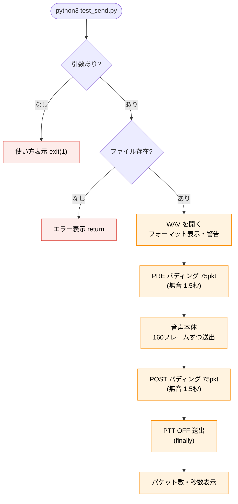

# test_send.py ソフトウェア仕様書

**対象ファイル:** `/opt/dvswitch_bot/bin/test_send.py`
**役割:** 指定した WAV ファイルを 1 回だけ USRP プロトコルで Analog_Bridge へ送信し、
音声送出経路（Analog_Bridge → md380-emu → MMDVM_Bridge → TGIF）が開通しているかを
確認するためのテストツール。

この文書は**スクリプト本体の内部仕様**を記述する技術文書です。試聴の操作手順は
『操作マニュアル』を参照してください。

---

## 目次

1. [概要と責務](#1-概要と責務)
2. [本体との関係](#2-本体との関係)
3. [実行環境・前提](#3-実行環境前提)
4. [定数仕様](#4-定数仕様)
5. [コマンドライン仕様](#5-コマンドライン仕様)
6. [関数仕様](#6-関数仕様)
7. [処理フロー](#7-処理フロー)
8. [USRP パケット仕様](#8-usrp-パケット仕様)
9. [運用上の注意](#9-運用上の注意)
10. [改修時の注意点](#10-改修時の注意点)

---

## 1. 概要と責務

`test_send.py` は、WAV ファイルを 1 つ指定して単発送信するだけの軽量ツール。
bot 本体を介さずに「音が出るか」「経路が通っているか」を切り分けるために使う。

責務はシンプルに次の1点。

- **指定 WAV を USRP パケット化し、前後に無音パディングを付けて Analog_Bridge へ送る**

カーチャンク検知・スケジューラ・音声合成などは持たない。送信のみに特化している。

---

## 2. 本体との関係

送信ロジックは `dvswitch_bot.py` の `send_usrp_wav_with_padding()` と**実質同一**。
本体から送信部分だけを抜き出した単機能版と考えてよい。

| 項目 | test_send.py | dvswitch_bot.py |
|---|---|---|
| USRP パケット構造 | 同じ | 同じ |
| 前後パディング | 75 パケット（1.5秒） | 同じ |
| 絶対時刻同期 | あり（`next_send_time`） | あり |
| 入力 | コマンド引数の WAV | 合成 or 固定 WAV |
| トリガ | 手動実行（1回） | ログ監視・スケジューラ |
| 設定ファイル | 読まない | bot_config.json を読む |

> 経路を疑うとき、本体ではなくこのツールで送ってみることで、「送信経路の問題」か
> 「検知・合成の問題」かを切り分けられる。

---

## 3. 実行環境・前提

| 項目 | 内容 |
|---|---|
| インタプリタ | Python 3（`#!/usr/bin/env python3`、UTF-8） |
| 依存 | 標準ライブラリ `os` / `sys` / `time` / `socket` / `struct` / `wave` のみ |
| 権限 | 特権不要（UDP 送信のみ。sudo 不要） |
| 送信先 | ローカルの Analog_Bridge（127.0.0.1:51000） |

外部コマンド・サードパーティライブラリへの依存はない。

---

## 4. 定数仕様

| 定数 | 値 | 意味 |
|---|---|---|
| `UDP_IP` | `127.0.0.1` | 送信先（Analog_Bridge） |
| `UDP_PORT` | `51000` | 送信先ポート（Analog の rxPort と一致） |
| `PACKET_INTERVAL` | `0.02` | パケット送信間隔（20ms） |
| `PRE_POST_PADDING_PACKETS` | `75` | 前後の無音パケット数（75×20ms＝1.5秒） |

いずれも `dvswitch_bot.py` の対応する定数と同じ値。

---

## 5. コマンドライン仕様

```
python3 test_send.py <WAVファイルパス>
```

| 引数 | 内容 |
|---|---|
| `sys.argv[1]` | 送信する WAV のパス（必須） |

引数が無い場合は使い方を表示して `exit(1)`。

実行例:

```bash
python3 /opt/dvswitch_bot/bin/test_send.py /opt/dvswitch_bot/002.wav
python3 /opt/dvswitch_bot/bin/test_send.py /opt/dvswitch_bot/001.wav
```

---

## 6. 関数仕様

| 関数 | 役割 |
|---|---|
| `send_usrp_wav(wav_path)` | WAV を前後パディング付きで USRP 送信する本体 |
| `__main__` ブロック | 引数チェックして `send_usrp_wav` を呼ぶ |

`send_usrp_wav` の処理:

1. ファイル存在確認（無ければメッセージを出して return）
2. WAV を開き、フォーマット（サンプルレート / チャンネル / ビット数）を表示
3. 8kHz / mono / 16bit でなければ警告（送信は続行）
4. PRE パディング → 音声本体 → POST パディングの順に送信
5. `finally` で PTT OFF を送り、ソケット・WAV を閉じる
6. 送信パケット数と概算秒数を表示

---

## 7. 処理フロー



`try ... finally` 構造により、送信途中で例外が起きても **必ず PTT OFF を送って**
ソケットを閉じる（送信状態が開きっぱなしになるのを防ぐ）。

---

## 8. USRP パケット仕様

`dvswitch_bot.py` と同一構造。

### ヘッダ（`struct.pack("!4sIIIIIII", ...)`）

| フィールド | 型 | 値 | 意味 |
|---|---|---|---|
| マジック | 4s | `b"USRP"` | プロトコル識別子 |
| シーケンス | I | `seq` | 0 から増加する連番 |
| （memory） | I | `0` | — |
| keyup（PTT） | I | `1`（送信中）/ `0`（終了） | PTT 状態 |
| 残り5フィールド | I×4 | `0` | 未使用 |

ペイロードは **320 バイト固定**（160 サンプル × 16bit）。

### 送信シーケンス

| 段階 | 内容 |
|---|---|
| PRE | 無音（`\x00`×320）を 75 回（1.5秒）、keyup=1 |
| 本体 | `wf.readframes(160)` で読み、320 バイト未満は 0 詰め、keyup=1 |
| POST | 無音を 75 回（1.5秒）、keyup=1 |
| 終了 | keyup=0 のヘッダ＋無音を 1 つ（PTT OFF） |

### 絶対時刻同期

```python
next_send_time = time.monotonic()
# 各パケット送出後:
next_send_time += PACKET_INTERVAL
time.sleep(max(0, next_send_time - time.monotonic()))
```

基準時刻からの累積で次回送出時刻を決め、処理時間のドリフトを蓄積させない。
本体と同じ方式で、これにより一定リズムでパケットが届く。

---

## 9. 運用上の注意

| 注意 | 内容 |
|---|---|
| **bot との二重送信** | bot 本体が動作中だと同じ UDP 51000 に二重送信になり音が崩れる。実行前に `sudo systemctl stop dvswitch-bot`（サービス名はハイフン）。テスト後に `start` で戻す |
| **フォーマット警告** | 8kHz/mono/16bit 以外は警告が出る。送信自体は続行するが、音が崩れる可能性 |
| **送信先固定** | 送信先は `127.0.0.1:51000` 固定。Analog_Bridge が同じホストで動いている前提 |
| **特権不要** | UDP 送信のみなので sudo 不要（bot の停止には sudo が要る） |

---

## 10. 改修時の注意点

| 項目 | 注意 |
|---|---|
| **本体と送信ロジックを揃える** | USRP パケット構造・パディング・絶対時刻同期は `dvswitch_bot.py` と同一。片方だけ変えると挙動が食い違う |
| **UDP_PORT の一致** | `51000` は Analog_Bridge の `rxPort` と一致が前提 |
| **PTT OFF を必ず送る** | `finally` の PTT OFF を外すと、中断時に送信状態が残る |
| **320バイト固定** | ペイロードは 160 サンプル×2 バイト＝320。読み取り単位 `readframes(160)` と対 |

---

*test_send.py ソフトウェア仕様書*
*対象: /opt/dvswitch_bot/bin/test_send.py（USRP 単発送信テストツール）*
*Contributors: JA2CCV / JI2TAB / JJ2YYK / OpenCCVoice Contributors*
